# CHAPTER 4 - Storage and Retrieval

```
Feynman 인용문 (서두)

"인생의 불행 중 하나는 모두가 사물의 이름을 조금씩 잘못 짓는다는 것이다. 
그래서 세상을 이해하는 것이 실제보다 더 어려워진다. 
컴퓨터는 본질적으로 산술 계산(compute)을 하는 기계가 아니다. […] 
컴퓨터는 본질적으로 **파일링 시스템(filing system)**이다."

— 리처드 파인만, Idiosyncratic Thinking 세미나 (1985)
```

파인만의 이 말은 "computer(컴퓨터)"라는 이름이 오해를 부른다는 지적입니다. 우리는 컴퓨터를 '계산기'로 생각하지만, 실제로 컴퓨터가 주로 하는 일은 데이터를 저장하고 다시 찾아오는 일이라는 것이죠. 
이 장의 주제와 잘 맞아떨어지는 인용입니다.

근본적으로 데이터베이스가 해야할 2가지 일은
- 데이터를 주면 -> 저장한다.
- 그리고 이 데이터를 나중에 요청하면 -> 다시 돌려준다.

3장에서는 데이터모델과 쿼리 언어에 대해 다뤘다
어떤 형식으로 데이터를 넣고, 나중에 어떤 인터페이스로 데이터를 요청하는 지.

이번챕터에서는 데이터베이스의 입장에서 같은 문제를 다루어본다(데이터베이스가 어떻게 데이터를 주고, 사용자가 요청했을 때 어떻게 데이터를 찾는지)


왜 애플리케이션 개발자가 데이터베이스가 내부적으로 저장과 조회를 어떻게 관리하는지 알아야하나?
=> 애플리케이션에 적절한 스토리지 엔진을 고를 필요가 있다.
=> 스토리지 엔진이 잘 동작하도록 설정하기 위해.

특히 OLTP(온라인 트랜잭션 처리)와 OLAP(온라인 분석 처리) 을 위한 스토리지 엔진에는 큰 차이점이 있는데,

이번 챕터에서는 OLTP용 스토리지 엔진에 대해 살펴본다.
1. 로그 구조화(log-structured) 스토리지 엔진 : 변경불가능한(immutable) 데이터 파일을 써내려가는 방식
2. B-tree 계열의 스토리지 엔진 : 기존 데이터를 제자리에서(in-place) 업데이트하는 방식

위 두 구조는 key-value 저장소나 보조 인덱스 구현에 사용된다.

이 장에서는 크게
- OLTP용 스토리지 엔진
  - 로그 구조화 스토리지 엔진
  - B-tree 계열 스토리지 엔진
- 분석용 스토리지 엔진
- 고급 인덱스
  - 다차원 인덱스(위도-경도 등 여러 차원의 값을 동시에 검색할 때)
  - 전문(Full-Text) 검색 인덱스 : Lucene, Elasticsearch 같은 검색 엔진이 텍스트에서 단어를 빠르게 찾기 위한 인덱스

## 1. Storage and Indexing for OLTP

아주아주 간단한 테이터베이스를 직접 만들어보면서 `로그` 와 `인덱스` 라는 개념을 살펴보자

```shell
db_set () {
  # key,value 형식으로 파일 끝에 추가
  echo "$1,$2" >> database
}
db_get () {
  # 해당 key로 시작하는 줄을 찾고, key 부분을 제거한 뒤, 마지막 줄만 반환
  grep "^$1," database | sed -e "s/^$1,//" | tail -n 1
}
```

위 두 함수로 key-value 저장소를 만들었다.

key와 value를 `,` 문자로 구분한 단순한 형태이다.

위 저장소의 중요한 특징은,
`db_set()` 함수를 호출할 때마다 파일 끝에 `추가`만 한다는 점. 
같은 키를 여러번 업데이트해도 이전 값을 덮어쓰지 않는다.  
=> 최신값을 찾으려면 키로 찾은 행들에서 마지막 줄을 봐야한다. (tail -n -1)

ex) 같은 키로 여러번 추가하면 get 시 마지막 값이 반환된다.
```shell
$ db_set 42 '{"name":"San Francisco","attractions":["Golden Gate Bridge"]}'
$ db_set 42 '{"name":"San Francisco","attractions":["Exploratorium"]}'

$ db_get 42
{"name":"San Francisco","attractions":["Exploratorium"]}
```

#### db_set()
단순하지만 `db_set()` 함수는 꽤 좋다.  
파일 끝에 추가하는 작업(append)은 일반적으로 매우 효율적이기 때문이다.

많은 데이터베이스에서 이런 추가 방식(append-only)만 가능한 로그를 사용한다.  
다만, 실제 데이터베이스는 더 많은 문제를 다뤄야한다
- 동시 쓰기 처리
- 디스크 공간 회수(로그가 영원히 자라는 것을 막기)
- 크래시 복구시 부분적으로 기록된 레코드 처리
- 등...

하지만 `기본 원리는 같다.`


💡 용어 주의: 보통 "로그(log)"라고 하면 애플리케이션이 출력하는 텍스트 로그를 떠올리지만, 이 책에서는 더 일반적인 의미로 씀. 
즉, "디스크에 추가만 되는 레코드의 연속(append-only sequence of records)". 
사람이 읽을 수 있는 형식일 필요도 없고, 바이너리여도 됩니다.


#### db_get()

반면 db_get()은 레코드가 많아질수록 성능이 처참해진다.

키 하나를 찾을때마나 파일을 처음부터 끝까지 스캔해야하지 때문이다. => O(n)

=> 특정 키의 값을 효율적으로 찾기위해 다른 자료구조가 필요하다 => 인덱스


#### 인덱스
이번 장에서 다양한 인덱싱 구조를 살펴보고 어떻게 비교되는지 알아보자.

인덱스는..
- 데이터를 특정한 방식으로 구조화하여 내가 원하는 데이터를 더 빨리 찾을 수 있게 함
- 같은 데이터를 여러 방식으로 찾고 싶다면, 서로 다른 여러개의 인덱스가 필요할 것이다.


인덱스는 원본 데이터(primary data)에서 파생된 추가적인 구조이다.  
많은 데이터베이스가 인덱스 추가-삭제를 지원하면서 데이터베이스의 내용에 영향을 주지 않고 오직 쿼리 성능에만 영향을 준다.  

추가적인 구조(인덱스 추가)는 비용(특히 쓰기 성능)이 따른다.
- 쓰기 입장에선 파일에 append하는 것보다 빠른 작업은 없다. (이게 가장 간단한 쓰기 연산이니까)
- 어떤 종류의 인덱스는 쓰기를 느리게 만든다. (인덱스도 매 쓰기마다 업데이트되어야 하니까)

위 특징이 저장 시스템의 핵심 트레이드오프이다.
- 인덱스는 읽기 쿼리 성능을 높인다
- 추가적인 디스크 공간을 차지한다
- 쓰기를 느리게 만든다.

위와 같은 이유로 데이터베이스는 기본적으로 모든것을 인덱싱하지 않는다.  
애플리케이션 개발자나 DBA가 애플리케이션의 전혁적인 쿼리 패턴의 지식을 사용하여 수동으로 인덱스를 선택해야함.
이렇게 해서 쓰기부담은 최소화하며 큰 이득만 취하는 인덱스만 골라 만들 수 있다.


## 1-1. Log-Structured Storage

### Hash Map
앞에서 간단하게 만든 저장소에서 db_set()은 유지하고 읽기 성능을 개선하고 싶다고 해보자.

방법으로, 메모리에 해시맵을 유지하여 모든 키와 가장 최근의 값이 저장된 파일의 바이트 오프셋을 매핑할 수 있다.

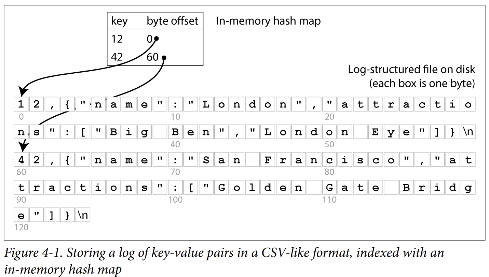

위와 같이 메모리 내에 맵을 구성하고,  
쓰기 시 파일에 새 key-value쌍을 append함과 동시에 해시맵도 같이 업데이트하여 데이터의 오프셋을 반영한다.

읽기시에는 
1. 해시맵에서 키를 찾아 파일 내 오프셋을 얻고
2. 그 위치로 파일에서 대상을 찾아내어
3. 값을 읽는다.

그리고 만약 파일에서 읽으려는 부분이 `파일시스템 캐시`에 이미 존재한다면 읽기 시 디스크 I/O가 전혀 없다. 

위와 같은 방식은 빠르지만 다음과 같은 문제점이 있따
1. 디스크 공간을 회수하지 못한다. (같은 키로 여러번 쓸 경우 업데이트가 아닌 append 방식이므로 이전 값이 남아있음)
2. 해시맵이 영속적이지 않다(휘발성). 따라서 데이터베이스 재시작시 전체 로그파일을 처음부터 끝까지 스캔하여 각 키의 최신 오프셋을 찾아야한다.
3. 해시 테이블이 메모리에 다 들어가야한다. (키 개수가 많으면 해시맵 자체가 ram용량 초과)
그럼 해시맵을 디스크에 만드는건 어떻냐?
=> 디스크 기반 해시맵을 잘 동작하게 하는건 매우 어렵다. 
   - 많은 랜덤 access I/O가 필요함
   - 디스크는 순차 접근엔 강하지만 랜덤 접근에 약함
   - 테이블이 가득찼을때 확장하는 비용이 큼. (확장 후 모든 키를 리해싱해야함, RAM은 빠르니까 그나마 나은데..)
   - 해시 충돌 처리 로직이 까다로움(디스크상에서 구현하기 복잡)
4. 범위쿼리가 비효율적임. 각 키를 해시맵에서 하나하나 조회해서 찾아야함 (예를 들어 10000~19999까지의 모든 키를 한번에 스캔하기 어려움)

### The SSTable file format
해시 테이블은 데이터베이스 인덱스로 자주 사용되지는 않는다. 
대신 키로 정렬된(sorted by key) 구조에 데이터를 보관하는 것이 훨씬 흔하다. 

SSTable(Sorted Strings Table)가 이런 구조이다. 
두가지 핵심 규칙이 있다.
- 키 순서로 정렬되어있다(sorted by key)
- 각 키는 파일에 단 한번만 등정한다(each key appears only once)

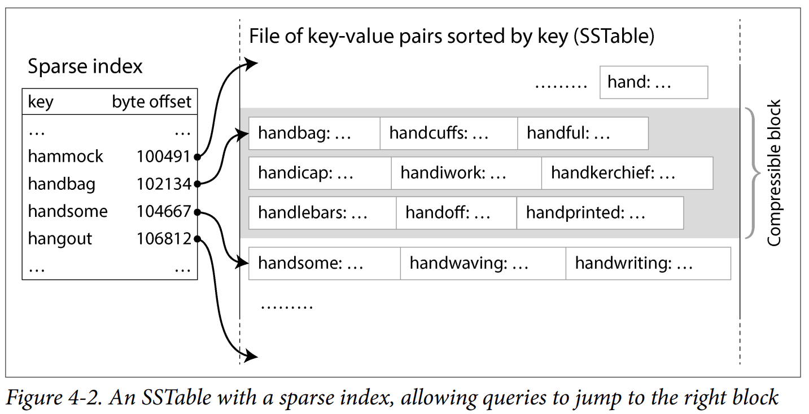

#### 희소인덱스
이제 모든 키를 메모리에 유지할 필요가 없다. 
SSTable 안의 key-value 쌍들을 몇KB로 묶고, 각 블록의 첫번째 키만 인덱스에 저장하면 된다. (4-2 그림 참고) 
이렇게 일부 키만 저장하는 인덱스를 희소인덱스 라고 한다.

이 인덱스는 SStable의 별도 영역에 저장되며 불변 B-tree, trie 등의 자료구조로 구성할 수 있다.

ex) `handiwork`를 찾는 과정
1. 희소 인덱스에서 `handiwork` 검색 -> 없음
2. 정렬되어있다는걸 아니까 handbag < handiwork < handsome 임을 알 수 있음.
3. handiwork는 반드시 handbag 블록 안에 있어야 함.
4. handbag의 오프셋으로 seek 한 뒤, 거기서부터 순차 스캔.
5. 블록은 몇KB수준이므로 빠르게 찾을 수 있음

또, 각 블록을 압축하여 저장할 수 있다.
- 디스크 공간 절약
- I/O 대역폭 절약
- 대신 CPU를 좀 더 사용함

#### SSTable 만들기/병합하기
SSTable 방식은 append-only로그보다 읽기 쉽지만 쓰기는 더 어렵다
- 단순히 끝에 append하면 정렬이 깨짐
- 만약 중간에 삽입하면 매 삽입시마다 정렬해야하므로 쓰기 비용이 비싸짐

해결책으로 append-only와 sorted의 하이브리드방식인 로그 구조화(log-structured) 접근 방식이 있다.
=> 이게 LSM-tree(Log-Structured Merge-Tree)의 동작원리

동작을 보면,
1. 쓰기가 들어오면 일단 메모리의 정렬된 자료구조에 추가한다. 
red-black tree, skip list, trie...

이 자료구조들은
- 어떤 순서로 키를 삽입해도 상관없음
- 효율적으로 조회 가능
- 정렬된 순서로 데이터를 읽어낼 수 있음


2. memtable이 일정 크기를 넘기면 디스크로 flush
- 정렬된 순서 그대로 디스크에 SSTable 파일로 저장
- 저장된 새 SSTable이 데이터베이스의 가장 최신 세그먼트가 됨
- 옛 세그먼트들은 별도 파일로 그대로 남음
- 각 세그먼트는 자기만의 인덱스(희소인덱스)를 가짐

새 SSTable을 디스크에 쓰는 동안에도 새로운 memtable인스턴스를 만들어서 쓰기를 계속 받을 수 있음(무중단쓰기)


3. 키로 값을 읽을때는 최신부터 옛것 순으로 찾음
- 먼저 memtable(메모리)에서 확인
- 없으면 가장 최신 디스크 세그먼트부터 확인... 반복하여 어디에도 없으면 DB에 없는 키임.

4. 백그라운드에서 머지 & 컴팩션
세그먼트가 자꾸 쌓이면
- 읽기 시 여러 파일을 뒤져야함
- 옛 값들이 디스크를 낭비함

그래서 주기적으로 백그라운드에서 여러 세그먼트 파일을 병합하고,  
덮어쓰기 되었거나 삭제된 값을 버린다.


---
세그먼트 파일 병합은 `mergesort` 알고리즘과 유사하다 (그림4-3참고)

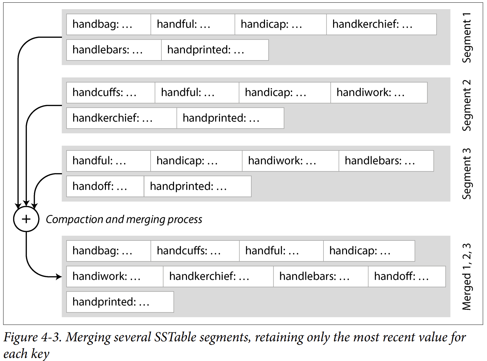

1. 여러 입력파일을 나란히 동시에 읽어서
2. 각 파일의 첫번째 키를 비교
3. 가장 작은 키(정렬기준)를 출력 파일에 기록
4. 그 키를 사용한 파일에서는 다음 키로 이동
5. 반복

ex)
```text
입력 SSTable A (옛 세그먼트)
apple   → 5
banana  → 7
cat     → 3
mouse   → 12

입력 SSTable B (최신 세그먼트)
apple   → 99    ← apple의 더 최신 값
banana  → 7     ← 동일
elephant → 50
mouse   → 88    ← mouse의 더 최신 값
```


```text
A 포인터: apple,5     B 포인터: apple,99
→ 같은 키! 더 최신 값(B의 99) 사용 → 출력: apple,99
→ A와 B 모두 다음으로

A: banana,7           B: banana,7
→ 같은 키! 더 최신 값 사용 → 출력: banana,7
→ A와 B 모두 다음으로

A: cat,3              B: elephant,50
→ cat이 더 작음 → 출력: cat,3
→ A만 다음으로

A: mouse,12           B: elephant,50
→ elephant가 더 작음 → 출력: elephant,50
→ B만 다음으로

A: mouse,12           B: mouse,88
→ 같은 키! 더 최신 값 사용 → 출력: mouse,88
```

```text
최종 병합된 SSTable
apple    → 99
banana   → 7
cat      → 3
elephant → 50
mouse    → 88
```

이 과정을 통해
- 각 키당 최신 값 하나만 남기면서 정렬된 상태를 유지할 수 있다.
- SSTable을 한번씩만 순회하면 되므로 메모리 사용량이 적다.


*풀어야할 문제*
memtable은 메모리에 있기 때문에 데이터베이스가 크래시될 때 데이터가 모두 사라진다.

이 때 스토리지 엔진은 매 쓰기마다 즉시 디스크에 별도로 append했던 파일을 사용한다.  
이 파일은 정렬되어있지 않지만 상관없다. (오직 memtable의 복원이 목적이기 때문)

복구과정은
1. 스토리지 엔진이 디스크의 로그파일을 처음부터 끝까지 읽어서
2. 각 항목을 memtable에 다시 적용한다 -> 복원완료

이 log 는 무한정 자라지 않는데, 
memtable이 flush될 때마다 복구를 위해 저장하던 log도 제거될 수 있기 때문이다.


*삭제*

LSM 방식에서는 데이터를 덮어쓰지 않는다. 
그저 새 값을 append할뿐

그러면 키를 삭제하고 싶을땐 어떻게 하는가?
=> Tombstone(묘비)

키를 삭제하려면 `이 키는 삭제됐다` 라는 특별한 삭제 레코드를 데이터파일에 append한다
```text
일반 쓰기:     key=42, value="San Francisco"
삭제 요청:     key=42, value=<TOMBSTONE>   ← 특수 표시
```

컴팩션(merge)시에, 
키가 동일한 옛 레코드가 tombstone 을 만나면 이전 값들을 모두 버리고,  
가장 오래된 세그먼트까지 도달하여 모든 과거 값이 버려지게 되면 그 때 tombstone 자체도 폐기 가능하다.


지금까지 설명한 알고리즘은 다음 시스템들에서 사용된다
- RocksDB : Facebook이 개발한 LSM 트리 기반 스토리지 엔진
- Cassandra : Apache의 분산 데이터베이스 시스템으로 LSM 트리 기반 스토리지 엔진 사용
- ScyllaDB : Cassandra와 호환되는 고성능 분산 데이터베이스 시스템으로 LSM 트리 기반 스토리지 엔진 사용
- HBase : Apache의 분산 데이터베이스 시스템으로 LSM 트리 기반 스토리지 엔진 사용

위 시스템들은 모두 Google Bigtable이라는 논문에서 영감을 받았으며,
SSTable과 memtable 용어도 이 논문에서 소개되었음.

LSM-tree알고리즘은 1996년에 처음 발표되었는데 더 이전의 log-structured filesystem 연구를 토대로 만들어졌음

이런 이유로 정렬된 파일을 머지/컴팩션하는 원리에 기반한 스토리지 엔진을 LSM 스토리지 엔진이라고 부름.

*불변세그먼트*
세그먼트는 다음 상황에서만 만들어지는데  
- memtable이 디스크로 flush될 때
- 기존 세그먼트들을 머지할 때

LSM엔진에서 세그먼트 파일은 수정되지 않으므로 불변이다. 

불변성의 이점은
- 컴팩션을 백그라운드에서 무중단으로 진행할 수 있다.
- 꼭 로컬디스크가 아니어도 된다 -> 오브젝트스토리지(ex, S3 등)에도 적합하다. 클라우드 시대에 적합한 아키텍처
- 크래시 복구가 단순해진다.
  - memtable을 flush하던 중 or 세그먼트를 머지하던 중 크래시 -> 미완성 SSTable나 머지결과 파일을 삭제하고 다시 시작하면 됨


#### Bloom filters
LSM 스토리지에서 는 한가지 약점이 있다.
=> 키를 읽을 때 여러 세그먼트 파일을 차례로 뒤져봐야 한다는 점

특히 두가지 경우에 느린데
1. 오래전에 마지막으로 업데이트된 키 -> 최신 세그먼트부터 차례로 뒤져봐야함
2. 아예 존재하지 않는 키 -> 모든 세그먼트를 다 뒤져야함

이에 대한 해결책으로 Bloom Filter가 있다.

Bloom Filter란? 
-> 특정 키가 특정 SSTable에 포함되어 있는지를 빠르게 확인하는 자료구조


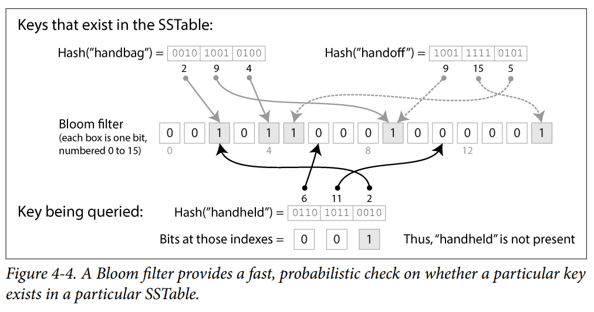

위 그림은 2개의 키과 16개의 비트를 가진 블룸필터 예

작동방식은
1. SSTable의 모든 키에 대해 해시 함수를 계산
2. 그 인덱스에 해당하는 비트들을 1로 설정, 나머지는 0으로 둠

ex) handbag의 경우
2, 9, 4 로 해싱되므로 각 인덱스의 비트를 1로 설정한다.

handheld를 key를 검색한다고 가정하면 
6, 11, 2로 해시되는데 모든 인덱스가 1이 아니므로 없다는 것을 알 수 있다.

이렇게 하여 약간의 추가공간을 희생해서 조회를 극도로 빠르게 수행할 수 있다.

##### 핵심규칙 - 거짓양성
블룸필터에서 중요한 규칙은 다음과 같다  
- 비트 중 하나라도 0이면 -> 확실하게 존재하지 않는다
- 조회한 비트가 모두 1이면 -> 있을수도 있고 없을수도 있다. (다른 키에 의해 1로 설정되었을 수도 있으므로)

거짓양성이 있다고 해서 문제가 되지 않는다.  
=> 존재하지 않는 키를 찾기 위해 불필요한 작업을 할 수 있지만, 존재하는 키를 존재하지 않는다고 판단하지는 않는다.

#### Compaction Strategies(압축 전략) 해석
중요한 것이 더 있다.
- LSM스토리지가 언제 압축을 수행할지
- 어떤 SSTable들을 압축에 포함할지


많은 LSM 스토리지 시스템에서는 어떤 압축 전략을 사용할지 설정할 수 있따  
설정을 살펴보자

1. Size-tiered Compaction(크기 계층 압축)  
더 최신이면서 작은 SSTable들이 더 오래되고 큰 SSTable로 병합되는 방식

ex) 4개의 256MB짜리 SSTable 4개가 하나의 898MB SSTable로 압축될 수 있음

이 방식의 장점은
- 대부분의 데이터가 더 큰 순차병합에서 몇 번만 다시 쓰이기 때문에 매우 높은 쓰기 처치량으로 처리할 수 있다. 

2. Leveled Compaction(레벨 압축)  
큰 SSTable 대신 SSTable 크기를 고정하고 이를 점점 커지는 레벨(L0, L1 ..)로 그룹화하는 방식

- L0 : 가장 최근에 쓰인 데이터를 담음
- L1~ : 키 범위로 분할된SSTable을 담는다
  - ex) L1에는 2개의 SSTable이 있을 수 있다. 첫번째는 키 a-m, 두번째는 n-z.
- 각 레벨은 자신만의 크기 제한을 가지며, 각 레벨은 그 앞 레벨보다 크다.
- 어떤 레벨의 SSTable이 합쳐져 최대 크기 제한을 초과하면, 레벨 i의 SSTable 하나 이상이 레벨 i+1로 병합되고 레벨 i에서 삭제됨

장점은  
- 압축이 점진적으로 진행될 수 있고 크기 계층 전략보다 디스크 공간을 적게 사용함
- 스토리지 엔진이 키 포함여부를 확인하기 위해 더 적은 수의 SSTable만 읽으면 돼서 읽기에 더 효율적이다.

*그래서 어떤 전략을 선택해야 하나?*  
대부분 쓰기 -> Size-tiered compaction  (더 크 SSTable로 병합되는 횟수가 몇번밖에 되지 않아서 쓰기 작업에 효율적임)  
읽기가 지배적 -> Leveld compaction  (SSTable 크기를 작게 고정하고 잘게 나누기때문에 레벨이 올라갈때마다 같은 데이터를 여러번 쓰기만, 키 범위로 분할을 하기 때문에 읽을 때 확인할 SSTable이 적어서 읽기에 유리함)  
쓰기에서 소수의 키만 자주 사용하는 경우엔 leveled compaction도 유리하다

도서관에서 책 한 권을 찾는다고 생각해 보세요.

Size-tiered = 큰 상자 몇 개에 책을 분류 없이 마구 담아둠. (책을 담을땐 편하지만, 찾을때 어려움)
Leveled = 책장이 많지만 알파벳순으로 칸이 정확히 나뉘어 있음. 책장(=레벨)마다 "이 책은 이 칸에 있어야 한다"가 딱 정해져 있어서, 각 책장에서 칸 하나만 확인하면 됨. (책을 담을땐 힘들지만 찾기가 쉬움)


#### Embedded Storage Engines
많은 DB가 네트ㅋ워크를 통해 쿼리를 받는 서비스 형태로 실행되지만  
네트워크 api를 노출하지 않는 이메디드 DB도 있다

특징은
- 별도의 서버가 아닌 애플리케이션 코드와 동일한 프로스세 안에서 실행된다
- 일반적으로 로컬 디스크의 파일을 직접 읽고 쓴다
- 네트워크 요청이 아닌 일반 함수 호출을 통해 상호작용한다.

ex) RocksDB, SQLite, LMDB, DuckDB...

언제 사용하나?
- 모바일 앱 : 로컬 사용자의 데이터 저장용으로 사용.
- 백엔드에서는 다음 상황에서 유용
  - 데이터가 단일 머신에 들어갈만큼 작을때
  - 동시 트랜잭션이 많지 않을때


## 1-2. B-Trees
키로 DB 레코드를 읽고 쓸때 가장 널리 사용되는 구조는 B-Tree

b-tree는
- 1970년에 도입되어 빠르게보편화되었고
- 지난 50년간 사용되며 검증된 구조
- 거의 모든 RDBMS에서 표준 인덱스구현이 되었다. (비관계형 DB에서도 많이 사용)

#### SSTable(로그 구조 인덱스, LSM)과의 비교  
- 공통점
  - B-Tree도 동일하게 키-값 쌍을 키 순서로 정렬해서 보관한다.
- 차이점
  - 분할단위 : log-structured index는 가변 크키 세그먼트인 반면, B-tree는 고정크기 블록/페이지
  - 쓰기방식 : log-structured index는 불변인 반면, B-tree는 페이지를 제자리에서 덮어쓰기 가능


#### 페이지 번호=디스크 상의 포인터
각 페이지는 페이지 번호(page number)로 식별 가능.  

포인터와 비슷하지만, 메모리가 아니라 디스크 상에 있는 포인터임.

모든 페이지가 동일한 파일에 저장되어 있다면 다음 공식이 성립함  
`페이지가 위치한 바이트 오프셋 = 페이지 번호 * 페이지 크기`

이 페이지 참조들을 사용해서 `페이지 트리`를 구성한다. (4-5 그림 확인)


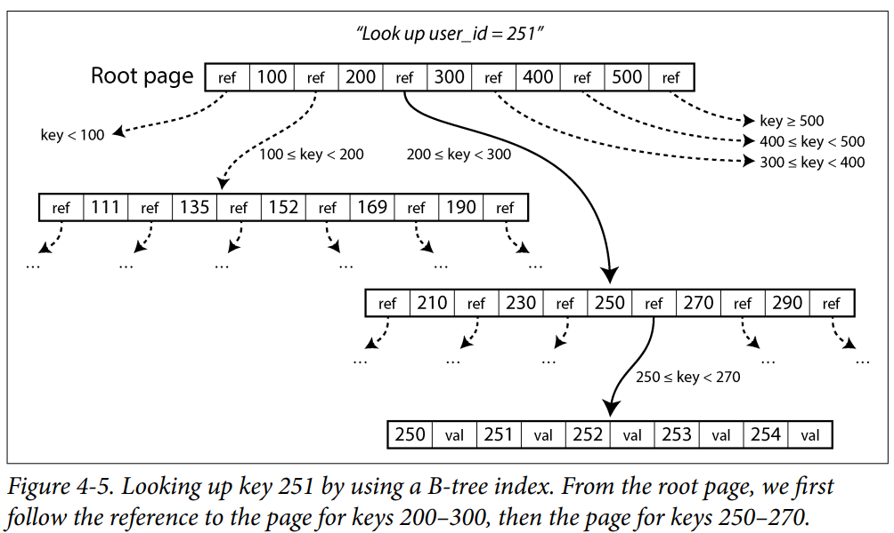


#### B-Tree에서 키를 찾는 과정
루트 페이지(root page) : 하나의 페이지가 B-Tree 루트로 지정되고, 키를 조회할때 여기서 시작한다.

4-5 그림은 키 251을 찾는 예이다.  
ex) b-tree에서 키 251 찾기
1. 루트 페이지에서 시작
2. 251은 200~300 사이 -> 그 사이의 페이지 참조를 따라감
3. 251은 250~270 사이 -> 그 사이의 페이지 참조를 따라감
4. ...
5. 개별키를담은 리프 페이지(leaf page)에 도달

리프 페이지는  각 키의 값이나, 값이 저장된 페이지에 대한 참조를 담는다.


#### 분기 계수(Branching Factor)
분기 계수 : B-tree의 한 페이지에 들어있는 자식페이지 참조의 개수

- 4-5 그림 예시에서는 분기계수가 6임
- 일반적으로는 수백(several hundred) 정도


#### 페이지 분할(page split)을 통한 B-tree 성장
새로운 키를 수용할 수 없을때 페이지는 절반씩 채워진 두 개의 페이지로 분할됨.  
부모페이지는 새로운 키 범위 세분하를 반영하도록 갱신됨.

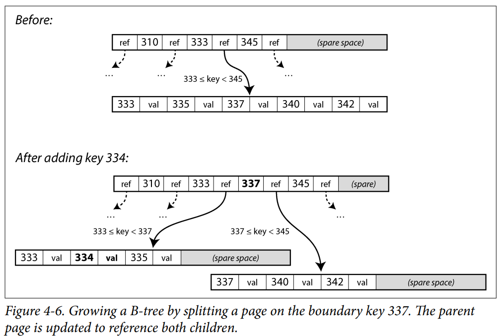

ex) 키 334를 넣는 예시
1. 334를 넣으려고 보니 페이지가 가득차있음
2. 페이지를 2개로 분할
    - 333~337
    - 337~345
3. 부모페이지 갱신
    - 두 자식 모두를 참조하도록 수정
    - 경계값을 337로 설정


##### 연쇄분할
만약 부모 페이지에도 새 참조를 넣을 공간이 부족하면 부모페이지도 분할될 수 있다.  
루트까지 이어져서 루트가 분할되면 그 위에 새로운 루트를 만든다


키 삭제는 병합이 필요할 수 있어서 더 복잡.


#### 균형
이 알고리즘으로 트리는 항상 균형을 유지한다.

`n개의 키를 가진 B-트리는 항상 **O(log n)의 깊이(depth)**를 가집니다.`

이는 다음을 의미한다
- 대부분의 데이터베이스 b-tree는 3~4 레벨의 깊이를 갖는다. => 원하는 페이지를 얻기 위해 많은 페이지 참조를 따라갈 필요가 없다

만약, 페이지 크기가 4KB이고, 분기계수가 500, 트리의 깊이가 4레벨 정도면 -> 약 250TB 까지도 저장할 수 있다

#### B-tree를 신뢰할 수 있게 만들기
b-tree에서의 쓰기는 디스크의 페이지에 새 데이터를 덮어쓰기한다.

덮어쓰기는 베이지의 위치를 변경하지 않는다. 모든 참조도 그대로 유효하다.

이는 LSM-트리 같은 log-structured 구조 인덱스와 대조되는데, log-structured는 수정하지 않고 append만 한다


근데, 여러 페이지를 한꺼번에 덮어쓰는 작업은 위험하다.
- 크래시 : 일부페이지만 쓰인 상태에서 DB가 죽으면 어떤 부모페이지도 없는 고아페이지가 생길 수 있다.
- 찢어진 페이지 : 하드웨어가 페이지전체를 원자적으로 쓰지 못하면 부분적으로만 쓰인 페이지가 생길 수 있다.

해결책 : WAL(Write-Ahead Log, 미리 쓰기 로그)  
WAL은 다음과 같이 동작한다
- append-only 파일이며
- 모든 B-tree 수정은 트리 페이지에 적용되기 전에 반드시 WAL에 먼저 기록 (Write-Ahead)
- 크래시 후 DB가 다시 뜨면, 이 로그를 사용하여 B-tree를 일관된 상태로 복원
- 파일시스템의 저널링과 유사. (실제 작업전에 무엇을 할지 저널이라는 영역에 기록함)


WAL의 두번째 역할 : 성능 향상과 내구성  
B-tree는 성능을 위해 
- 수정된 모든 페이지를 디스크에 즉시 쓰지 않고 잠시 메모리에 버퍼링함

이 때 WAL이 크래시 상황에서도 데이터가 손실되지 않도록 보장하기 때문에 가능한 일

#### Using B-tree variants(B-Tree 변형 사용)
B-tree는 오래되었고 그간 수많은 변형이 생겼다

1. copy-on-write 방식  
일부 DB(LMDB 등)ㅇ선 크래시 복구를 위해 WAL대신 copy-on-write 방식을 사용함

작동방식은
- 수정된 페이지를 다른 위치에 새로 씀(제자리 덮어쓰기 안함)
- 새로 쓴 위치를 가리키는 부모페이지들의 새 버전을 트리에 생성
- 이 변경을 부모의 부모로... 루트까지 전파

장점은
- 덮어쓰기가 없으므로 찢어진 페이지나 손상된 트리 위험이 없음
- 동시성 제어에 유용(이전 버전이 남아있으므로 옛 버전을 일관되게 읽을 수 있음)

2. 키 약여화(KeyAbbreviation)로 공간 절약
전체 키를 저장하지 않고 키를 축약 함으로써 페이지 공간 절약

핵심 원리
- 트리 내부 페이지의 키는 경계의 역할만 하면 충분함(실제 값은 리프노드에만)
- 따라서 경계를 구분할 수 있을 만큼의 최소 정보만 담으면 됨

효과
- 한 페이지에 더 많은 키를 넣을 수 있음 -> 분기 계수 증가 -> 트리 레벨 적어짐 -> 조회가 빨라짐

B+ Tree가 이런 방식

3. 리프 페이지의 순차 배치
정렬된 순서로 키 범위를 스캔하는 속도를 높이기 위해 리프 페이지들이 디스크상에 순차적인 순서로 배치되도록 트리를 배열

목적
- 리프페이지가 디스크에 순서대로 놓여있으면 범위스캔시 디스크 탐색 횟수가 줄어듬

한계
- 트리가 커질수록 이 순서를 유지하기 어려움(페이지 분할이 발생할때 물리적 순서가 흐트러짐)


4. 추가 포인터(additional pointers)
트리에 추가 포인터를 추가.

ex) 각 리프 페이지에 왼쪽/오른쪽 형제 페이지에 대한 참조를 추가하는 등.

효과
- 키를 순서대로 스캔할때 부모 페이지로 다시 점프하지 않아도 됨 -> 순차 스캔 효율적

B+ Tree가 이런 방식


## 1-3. Comparing B-Trees and LSM-Trees
B-Tree와 LSM-Tree를 비교해보면

LSM-트리는 쓰기가 많은 애플리케이션에 적합하고, B-Tree는 읽기가 더 빠름

다만 
- 벤치마크는 워크로드의 세부사항에 민감하고
- 유효한 비교를 하려면 특정 워크로드로 직접 시스템을 테스트해야함
- 그리고 두 트리는 양자택일이 아니고 두 방식을 혼합할 수도 있음


#### Read performance(읽기 성능)
1. 특정 키 하나 찾기
b-tree
- 각 레벨에서 페이지를 하나씩 읽음
- 레벨수가 보통 3~4단계이므로 읽기가 빠르고 예측 가능한 성능을 가짐

LSM
- 여러 SSTable을 확인해야 하는 경우가 많음
- 하지만 블룸 필터(bloom filter)가 필요한 디스크 I/O횟수를 줄여줌

둘 다 좋은 성능을 낼 수 있으며, 더 나은것은 스토리지 엔진과 워크로드 세부 사항에 달려있음

2. 키 범위 스캔
B-tree
- 트리의 정렬된 구조를 활용하 수 있어 단순하고 빠름

LSM
- SSTable 정렬을 사용할 수 있지만 모든 세크먼트를 병렬로 스켄하고 결과를 병합해야함.
- 또한 블룸필터는 도움이 안됨(범위 내 모든 키의 해시를 계산해야하는데 이는 비현실적)


3. 쓰기 처리량과 지연
LSM
- 높은 쓰기 처리량에서 압축 프로세스가 쓰기 속도를 따라잡지 못하면 memtable이 가득 찼을때 지연 발생 가능
- 이런 상황에서 많은 스토리지 엔진이 백프레셔를 적용함. (memtable이 디스크에 다 쓰일때까지 모든 읽기, 쓰기 일시중단)


현대 SSD에서는 여러 독립적인 읽기를 병렬로 수행할 수 있는데  
이를 잘 활용하려면 스토리지 엔진을 세심하게 설계해야함


#### Sequential vs random writes(순차쓰기 vs 무작위 쓰기)
두 알고리즘의 쓰기 방식을 살펴보자

B-tree
- b-tree는 덮어쓰기 방식
- 덮어써야할 페이지는 디스크 어디에든 있을 수 있음
- 무작위 쓰기(random writes)이며 작고 흩어진 쓰기가 많음

LSM
- LSM은 append-only이며 memtable을 내보내거나 기존 세그먼트를 압축할 때 세그먼트 파일 전체를 한번에 씀
- 각 세그먼트 파일은 B-tree의 페이지보다 훨씬 크다
- 순차 쓰기(sequential writes) 이며 크고 적은 쓰기 패턴

핵심
- 디스크는 일반적으로 순차쓰기를 더 잘한다 -> LSM이 일반적으로 더 높은 쓰기 처리량
- 이 차이는 HDD에서 특히 크다.( 헤드가 물리적으로 이동하므로 무작위 쓰기가 매우 느림)

#### Sequential Versus Random Writes on SSDs - SSD에서는 어떨까?
그럼 SSD 에서는 어떨까?
- HDD에서는 순차쓰기가 무작위 쓰기보다 훨씬 빠르다. 헤드가 기계적으로 이동해야하니까
- SSD에서는 이런 기계적인 한계가 없다. 

그럼에도 SSD도 순차쓰기가 처리량이 더 높다. 왜 그럴까?  
=> 결론적으로는 읽기/쓰기 단위와 지우기 단위가 달라서
- 플래시메모리(SSD를 구성하는 저장 매체)는 페이지 단위(보통 4KiB)로 읽기/쓰기
- 지우기는 블록 단위(보통 512KiB)

지울 때 한 블록에 있는 페이지는 다음과 같이 분류할 수 있다.
- 여전히 유효한 데이터를 담고 있는 블록
- 더이상 필요 없는 데이터를 담고 있는 블록

그래서 지우기 전에 SSD의 컨트롤러는 다음 작업을 수행
- 유효한 데이터를 담은 페이지들을 다른 블록으로 옮겨야함 -> 그래야 블록 전체를 안전하게 지울 수 있음
- 이를 가비지컬렉션(GC)라고 한다.

순차 쓰기 vs 무작위 쓰기가 GC에 미치는 영향을 살펴보면,  
순차 쓰기
- 한 번에 큰 데이터 덩어리를 쓰기 때문에 한 블록(512KiB) 전체가 단일 파일에 속할 가능성이 높음
- 그 파일이 나중에 삭제되면-> 블록 전체가 한번에 무효 -> GC없이 블록 전체를 지울 수 있음

무작위 쓰기
- 한 불록 안에 유효 페이지와 무효 페이지가 뒤섞일 가능성이 높음
- 따라서 블록을 지우기 전에 GC가 더많은 작업(유효페이지 옮기기)을 수행해야함

GC가 발생하면 다음의 악영향을 끼침
- 쓰기 대역폭 잠식 : GC가 사용하는 쓰기 대역폭(유효 페이지를 옮기는 데 사용하는 대역폭)을 사용할 수 없음
- 플래시 메모리 마모(wear out) : GC가 유효페이지를 옮기는데 쓰기가 발생하기 때문에 플래시메모리의 마모에 기여함(플래시 메모리는 쓰기/지우기 횟수에 한계가 있음)


#### Write amplification(쓰기 증폭)
한 번의 쓰기가 여러번의 디스크 I/O가 될 수 있다.

LSM-tree에서는
- 먼저 log에 기록할때 디스크 I/O가 발생하고
- memtable이 disk에 쓰일때 디스크 I/O가 발생하고
- 키-값 쌍이 압축에 포함될 때마다 디스크 I/O가 발생한다

B-tree에서는 모든 데이터가 최소 2번 쓰이는데
- WAL(write-ahead log)에 한번
- 트리 페이지 자체에 한번

쓰기증폭은 LSM과 B-Tree 둘 다에 존재하는 문제이다.  
다만 전형적인 워크로드에서는 LSM-tree가 쓰기증폭이 더 낮은 경향이 있다.
- 페이지 전체를 쓸 필요가 없고
- SSTable의 청크를 압축하 수 있기 때문이다.

=> 따라서 LSM 스토리지 엔진이 쓰기 중심 워크로드에 잘 맞는 경향이 있다.


#### Disk space usage(디스크 공간 사용)
B-Tree 단편화(Fragmentation) 문제  
B-tree는 시간이 지나면서 단편화 될 수 있다
- 많은 키가 삭제되면 DB 파일에 B-tree가 더 이상 사용하지 않는 페이지가 많이 남음
- 이후 B-tree에 추가되는 데이터가 이 페이지를 사용할 수 있음
- 근데 이 페이지들이 파일 중간에 있어서 OS에 쉽게 반환할 수 없다. (비어있는데도 사용을 할 수가 없음)
- 그래서 DB는 페이지를 적절히 이동히시는 백그라운드 프로세스가 필요하다(PostgreSQL의 vacuum 프로세스)

LSM-Tree, 단편화에 더 강함
- 압축프로세스가 어차피 데이터 파일을 주기적으로 다시 씀
- SSTable에는 사용되지 않는 공간이 있는 페이지가 없음
- 게다가 SSTable에선 키-값 쌍 블록을 더 잘 압축할 수 있어서 b-tree보다 디스크상의 파일이 더 작아지는 경우가 많음

다만, 
- LSM-Tree에서는 압축으로 제거될때까지 최신이 아닌 key-value가 디스크를 차지함
- 압축 중 디스크 공간을 더 많이 사용함


데이터 삭제의 어려움(규제 준수 관점에서)  
데이터의 복사본이 여러개 있는 경우 데이터 보호 규정 준수 관점에서 문제가 될 수 있다.  

대부분의 LSM 스토리지 엔진에서,  
툼스톤(tombstone)이 모든 압축 레벨을 통과해 전파될때까지 상위레벨에는 여전히 삭제되지 않은 데이터가 존재할 수 있다.


SSTable 불변성의 장점  
SSTable 세그먼트 파일의 불변(immutable) 특성은 특정 DB 스냅샷을 찍고 싶을때 유용하다. (백업, 테스트용 복사본 등)  
- memtable을 디스크에 쓰고 그 시점에 어떤 세그먼트 파일이 존재했는지 기록하면 됨.
- 또, 스냅샷에 포함된 파일을 삭제하지 않는다면, 파일을 실제로 복사할 필요가 없다(파일이 불변이므로 그대로 두면 됨)
- B-tree에서는 이런 스냅샷을 효율적으로 찍기가 더 어렵다.(페이지가 계속 변하므로)


## 1-4. Multicolumn and Secondary Indexes (다중 컬럼과 보조 인덱스)
지금까지는 key-value 인덱스에 대해서만 다뤘다. (=> 관계형 모델에서 pk)

기본키의 역할
- 데이터를 유일하게 식별
- 다른 레코드들이 그 기본키로 해당 행이나 문서를 참조할 수 있다
- 인덱스는 참조를 해석하는데 사용된다(이 id에 해당하는 실제 데이터는 어디에 있나?)

#### Secondary index(보조 인덱스)
보조 인덱스를 갖는 것도 흔하다.

RDB에서
- `CREATE INDEX` 로 여러 개의 보조 인덱스를 생성할 수 있다
- 보조 인덱스를 통해 기본키가 아닌 다른 컬럼으로도 검색할 수 있다.


pk와 다른점
- 값이 유일하지 않다. -> 같은 인덱스 항목 아래에 여러 행이 있을 수 있다.


pk와 달리 하나의 인덱스 항목 아래에 여러 행이 있을 수 있어서 이 문제를 해결해야한다.  
다음 두 가지 방법이 있다
1. 인덱스의 값을 `리스트`로 만들기
ex) user_id=42 -> [행3, 행7, 행15, ...]

2. 각 학몽에 행 식별자를 덧붙여 유일하게 만들기
ex) (user_id=42, 행3), (user_id=42, 행7) ...


LSM-tree냐 B-Tree냐에 구애받지 않고 모두 인덱스를 구현하는데 사용될 수 있다.


## 1-5. Storing Values Within the Index(값을 인덱스 안에 저장하기)
인덱스에서 key는 쿼리가 검색하는 기준.  
키 외에도 인덱스의 종류에 따라 추가 데이터를 저장할 수 있는데 다음과 같은 3가지 방식이 있다


1. Clustered Index
실제 데이터가 인덱스 구조 안에 직접 저장되는 방식의 인덱스.  
인덱스를 찾으면 거기에 실제 데이터가 바로 들어있음 -> 추가 조회 불필요  
ex)
- MySQL의 InnoDB 스토리지 엔진 : 테이블의 기본키가 항상 Clustered Index


2. Heap File - 참조(Reference)를 저장하는 방식
Clustered Index와 다르게 실제 데이터에 대한 참조를 저장하는 방식  

여기서 또 두가지 방식으로 나뉘는데
- 해당하는 행의 기본키를 기리키는 방식(InnoDB의 보조인덱스가 이 방식)
- 디스크 상의 위치를 직접 참조하는 방식

디스크 상의 위치를 직접 참조하는 방식에서,  
행들이 저장되는 곳을 힙 파일(Heap file)이라고 부름

힙 파일의 특징은
- 특정한 순서 없이 데이터를 저장

힙 파일을 사용하는 이유는
- 보조인덱스가 여러개일 때 실제 데이터를 한 곳에만 두고 위치만 가리키므로 데이터 중복을 피할 수 있음

3. Covering Index(커버링 인덱스)
위 두 방식의 중간지점

전체 행은 힙이나 기본키 클러스터형 인덱스에 저장하면서,  
추가로 테이블의 일부 컬럼을 인덱스 안에 함께 저장한 인덱스.

효과
- 일부 쿼리에서 인덱스만으로 답변 가능. (기본키나 힙파일을 볼 필요 없음)

트레이드오프
- 일부 쿼리가 빨라지지만 데이터가 중복되므로 인덱스가 디스크 공간을 더 많이 사용 -> 쓰기 성능 저하


#### Heap file 업데이트시 까다로운 점
키는 그대로 두고 값만 없데이트 하는 경우 까다로울 수 있다.

1. 새 값이 기존 값보다 크지 않을 때
=> 레코드를 제자리에서 덮어쓸 수 있으므로 간단하다

2. 새 값이 기존 값보다 클 때
=> 충분한 공간이 있는 힙으로 레코드를 옮겨야 할 가능성이 크다.

이 경우 두가지 처리방식이 있는데
- 모든 인덱스를 갱신하여 레코드의 새 힙 위치를 가리키게 함
- 기존 힙 위치에 전달 포인터(forwarding pointer)를 남겨둠 -> '이 레코드는 저쪽으로 이사갔어'

이게 힙 파일에서 숨어있는 비용


## 1-6. Keeping Everything in Memory (모든 것을 메모리에 보관)
지금까지의 모든 자료구조는 `디스크의 한계`에 대해 대응하기 위한 대답이었음(LSM-tree, B-tree, bloom filter, heap file ...)

디스크는 단점이 있다
- 메인메모리에 비해 다루기 까다롭다
- HDD, SSD 상관없이 읽기/쓰기 성능 증대를 위해서는 데이터를 신중하게 배치해야한다.

이를 감수하고 디스크를 사용하는 이유는
- 내구성 : 전원을꺼도 내용 유지(비휘발성)
- 가격 : GB당 비용이 저렴


다만 RAM 이 저렴해지면서 비용논리는 무너지고 있는데
- 대부분의 데이터셋은 그리 크지 않고 데이터 전부를 메모리에 보관할만하다.
- 필요하면 여러 머신에 분산할수도 있다.
=> 이게 인메모리 데이터베이스의 등장 배경임

보통 인메모리 DB는 다음 경우에 사용
- 캐싱 용도 전용으로 사용하거나
- 머신 재시작시 데이터가 사라져도 괜찮은 경우

만약 인메모리 DB에서 내구성을 목표로 한다면(재시작시 복구를 하는 등)
- 변경사항 로그를 디스크에 기록하거나
- 주기적으로 스냅샷을 디스크에 기록하거나
- 인메모리 상태를 다른 머신에 복제하여 해결


인메모리 DB가 빠른 진짜 이유
- 디스크를 안 읽어서 빠르다는 인식은 잘못된 것. OS가 최근 사용한 디스크 블록을 메모리에 캐시하기 때문에 디스크 기반DB도 메모리에 캐시되어 있으면 안읽음
- 진짜 이유는 `데이터구조를 디스크에 쓸 수 있는 형태로 인코딩 하는 오버헤드`가 없기 때문

추가적인 이점으로,  
디스크 기반 인덱스로는 구현하기 어려운 데이터 모델(우선순위 큐, 집합 등)을 제공할 수 있다 


## 2. Data Storage for Analytics (분석을 위한 데이터 저장소)
데이터 웨어하우스의 데이터 모델은 주로 `관계형 모델`  
이유는 SQL이 분석 쿼리로 사용하기에 적합해서

데이터 웨어하우스와 관계형 OLTP DB 모두 SQL 쿼리를 사용하기 때문에 비슷해보인다.  
하지만 둘은 매우 다른 쿼리 패턴에 최적화 되어있어 내부는 상당히 다르게 보일 수 있음.
- OLTP(Online Transaction Processing) : 짧고 빈번한 트랜잭션 (ex, 주문 1건 처리, 사용자 정보 조회 등)
- 분석/데이터 웨어하우스(OLAP) : 대량의 데이터를 훑는 복잡한 집계쿼리 (ex, 지난 분기 지역별 매출 합계 등)
 

#### HTAP 데이터베이스(Hybrid Transactional and Analytical Processing, 하이브리드 트랜잭션·분석 처리)
DB 벤더사들은 OLTP/OLAP 용도에 따라 하나만 지원하는데에 집중함.

예외적으로 HTAP 데이터베이스가 있는데,  
하나의 DB내에서 트랜잭션 처리와 데이터 웨어하우징을 모두 지원하기도 한다.  
ex) Microsoft SQL Server, SAP HANA, SingleStore ...

사용자에게는 단일 SQL 창구만 보이면서  
내부적으로는 트랜잭션용 엔진과 분석용엔진이 따로 돌아감


이 단락에서는  
데이터 웨어하우스와 OLTP DB는 비슷해보이지만 근본적으로 다른데  
왜 이렇게 따로 발전했는데를 알아본다.


## 2-1 Cloud Data Warehouses(클라우드 데이터 웨어하우스)
기존 데이터 웨어하우스 벤더들은 온프레미스 배포와 칼루우드 기반 솔루션을 모두 제공함.

근데 고객들이 클라우드로 이동하면서, 클라우드 전용 데이터 웨어하우스가 널리 채택됨.
ex) Google Cloud BigQuery, Amazon Redshift, Snowflake ...


#### 클라우드 데이터 웨어하우스의 장점
- 확장 가능한 클라우드 인프라 활용 : 오브젝트 스토리지, 서버리스 연산 플랫폼 같은 클라우드 인프라 활용 가능
- 다른 클라우드 서비스와의 더 나은 통합
  - 자동 로그 수집 지원
  - 데이터 처리 프레임워크(ex, Google cloud Dataflow, AWS Kinesis 등)와 쉽게 통합
- 탄력성 - 핵심 구조적 차이
  - 데이터가 로컬 디스크가 아닌 오브젝트 스토리지에 영구저장됨 -> 스토리지 용량과 쿼리용 컴퓨팅 자원을 독립적으로 조정가능 -> 비용 효율화 가능


#### 오픈소스 웨어하우스의 분해
Apache Hive, Spark같은 데이터 웨어하우스도 클라우드와 함께 진화.

분석용 데이터의 저장이 오브젝트 스토리지로 이동하면서 오픈소스 웨어하우스도 분해되기 시작함.

Hive같은 단일 시스템에 통합되어있던 구성요소들이  
이제는 별도의 독립 컴포넌트로 종종 구현됨

분해된 컴포넌트를 살펴보면

1. Query engine(쿼리엔진)  
역할 : SQL 쿼리 파싱, 실행계획으로 최적화, 데이터에 대해 쿼리 실행
ex) Trino, Apache DataFusion, Presto

2. Storage format(스토리지 포맷)  
역할 : 테이블의 행이 파일 안에서 바이트로 어떻게 인코딩 되는지 결정  
ex) Parquet, ORC 등..

3. Table Format(테이블 포맷)  
'어떤 파일들이 한 테이블을 구성하나'를 정의함  
역할 : 어떤 파일들이 하나의 테이블을 구성하는지 + 테이블의 스키마를 정의함

Parquet 같은 포맷으로 쓰인 파일은 보통 불변이다.  
=> 그러면 행 삽입과 삭제를 어떻게 지원하나?

불변 파일 위에 어떤 파일 집합이 현재 테이블인가 라는 메타 데이터 계층을 얹어서 변경을 표현하는 방식으로 해결  
'어떤 파일들이 한 테이블을 구성하나'를 정의함
=> 앞서 봤던 불변인 SSTable + 스냅샷 느낌

ex) Apache Iceberg, Databricks의 Delta 포맷

4. Data Catalog(데이터 카탈로그)  
'어떤 테이블들이 한 데이터베이스에 포함되나'를 정의함

역할 : 테이블을 생성, 이름변경, 삭제하는데 사용  
특징 : 스토리지 포맷, 테이블 포맷과 달리 독립적인 서비스로 실행되며, REST 인터페이스로 쿼리 가능


## 2-2. Column-Oriented Storage (컬럼 지향 저장)
데이터 웨어하느스는 관례적으로 관계형 스키마를 사용함.

그 구조는 다음과 같다
- fact table : dimension table에 대한 외래키 참조를 담음
- dimension table : 부가 정보(날짜, 제품 등)를 담음

규모 문제
- 팩트 테이블에 큰 규모(수 조개의 행, 페타바이트 규모)의 데이터가 있으면 효율적 저장과 쿼리가 어려움
- 디멘션 테이블은 보통 훨씬 작고 관리하기 쉬움(보통 수백만 행 수준)

그래서 이 절은 팩트(fact)의 저장에 집중

#### 쿼리에서 핵심
팩트 테이블은 종종 칼럼이 100개를 넘기지만 실제로 전혁적인 쿼리에서는 4~5개의 컬럼만 접근한다. (분석에서는 select * 같은 쿼리 잘 사용 안함)


```sql
SELECT dim_date.weekday
     , dim_product.category
     , SUM(fact_sales.quantity) AS quantity_sold
  FROM fact_sales
  JOIN dim_date ON fact_sales.date_key = dim_date.date_key
  JOIN dim_product ON fact_sales.product_sk = dim_product.product_sk
 WHERE dim_date.year = 2024
   AND dim_product.category IN ('Fresh fruit', 'Candy')
 GROUP BY dim_date.weekday, dim_product.category
```

위 쿼리는 `요일별 사람들이 과일과 사탕 중 무엇을 더 사는 경향이 있는지`를 분석하는 쿼리

특징을 살펴보면
- 많은 수의 행에 접근
- 하지만 단 3개워 컬럼만 필요로 함


#### 행 지향 저장(Row-Oriented Storage)의 비효율
대부분의 OLTP 데이터베이스는 행 지향(row-oriented) 방식으로 저장
- 한 행의 모든 값이 서로 인접하게 저장됨
- 문서 데이터베이스도 비슷

행 지향 저장 방식에서 위 쿼리를 실행하면  
1. `fact_sales.date_key`나 `fact_sales.product_sk`에 인덱스가 있어서 원하는 행의 위치를 찾을 수 있다고 가정하자
2. 하지만 인덱스로 위치를 찾아도 행 지향 엔진에서는
   - 모든 행(그리고 각 행의 모든 컬럼)을 디스크에서 메모리로 전부 로드
   - 파싱
   - 필터링 의 과정을 거쳐야함
3. 결론적으로 매우 오랜 시간이 걸림


#### 왜 비효율적인가?
행 지향에서는 행의 모든 값이 디스크에 붙어 있음.

`quantity` 컬럼 하나만 읽고 싶어도 나머지 칼럼까지 디스크에서 같이 끌어 올림. -> 디스크I/O 낭비

이 문제를 칼럼 지향 저장으로 풀어보자.


#### 컬럼 지향 저장(Column-Oriented Storage)
한 행의 모든 값을 저장하는 대신,  
각 컬럼의 모든 값을 함께 저장하는 아이디어

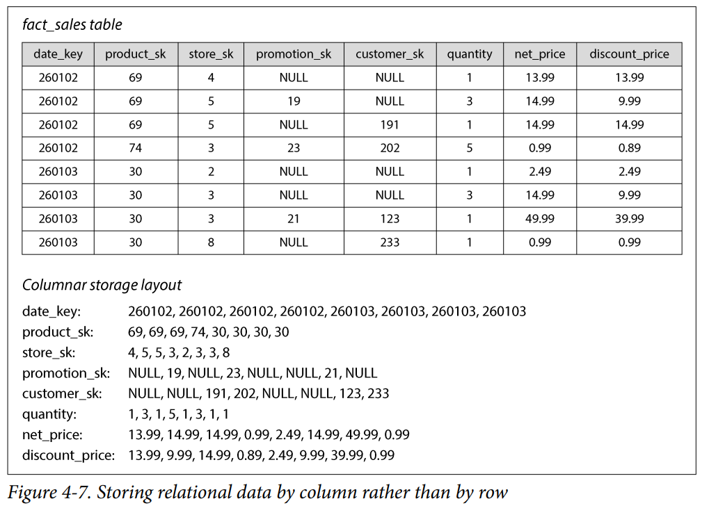

효과
- 쿼리는 그 쿼리에서 사용하는 컬럼만 읽고 파싱하면됨 -> 불필요한 디스크I/O 없어짐

칼럼 저장은 관계형 데이터 모델 뿐 아니라 비관계형에도 적용된다.


*행을 재조립하는 방법*    
컬럼 지향 저장에선 각 컬럼이 행을 같은 순서로 저장한다는 데에 의존한다.  
ex) 23번째 엔트리를 얻고 싶다면, 각 개별컬럼에서 23번째 항목을 가져온 뒤 합치면 테이블의 23번째 행을 만들 수 있다.


여기서 중요한 점은 컬럼을 따로 저장하지만 명시적인 행 ID를 저장하지 않는다는 점이다.  
오직 모든 컬럼이 같은 순서를 유지한다는 약속만으로 순서정보를 통해 행을 복원한다.


*실제 구현 - 컬럼을 통째로 저장하지 않는다*  
- 실제 컬럼 저장 에닌은 컬럼 전체를 한 번에 저장하지 않음
- 대신 수천~수백만 행 단위의 블록으로 나누고 각 블록 안에서 각 컬럼의 값을 별도로 저장함

*날짜 범위 최적화*  
- 많은 쿼리들이 날짜 범위를 사용하므로 각 블록에서 특정 타임스탬프 범위의 행들을 담게 만드는 것이 일반적
- 쿼리는 필요한 날짜 범위의 블록 안에서 필요한 컬럼만 로드하면 됨


과정은 
1. 블록 단위로 날짜 범위에 안맞는 블록은 통째러 건너뜀
2. 남은 블록 안에서 필요한 컬럼만 취함


*어디에 사용되는가?*  
거의 모든 분석용 데이터베이스가 컬럼 저장을 사용함

#### Column Compression(컬럼 압축)
데이터 압축을 통해 디스크 처리량과 네트워크 대역폭 요구를 줄일 수 있다

컬럼 지향 저장은 압축에 매우 잘 맞는다.

이유는,
- 각 컬럼 단위로 값을 보면 상당히 반복적이다 -> 반복이 많으면 압축에 좋다.
- 보통 같은 컬럼이면 같은 종류의 데이터라서 비스하거나 반복됨

##### Bitmap Encoding(비트맵 인코딩)
컬럼 데이터에 따라 다양한 압축 방식이 사용될 수 있는데, 효과적인 방식중 하나로 비트맵을 알아보자

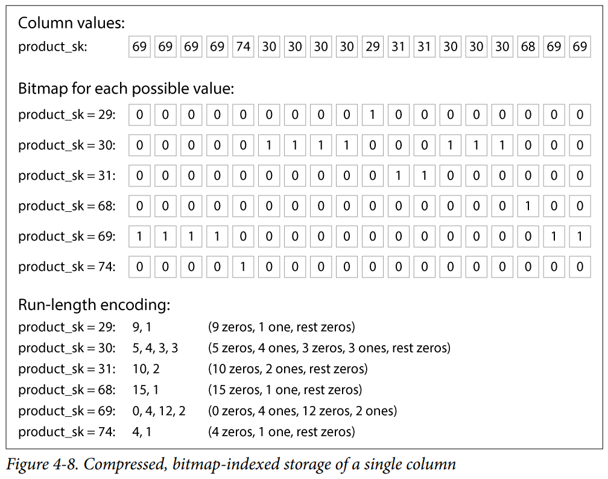

압축 과정은 다음과 같다.
1. 고유값이 N개라면 각 고유값마다 행의 길이헤 해당하는 비트맵 생성
2. 고유값이 위치한 행마다 비트 하나
3. 행이 그 고유값을 가지면 1, 아니면 0


*비트맵을 더 압축하기(Run-length encoding)*  
위 비트맵 방식대로면 보통 0이 매우 많다.(희소함)

이런 경우 추가로 run-length 인코딩이 가능함  
과정은,  
1. 연속된 0 또는 1의 개수를 세어서 그 개수만 저장함


*Roaring Bitmaps*  
위 두 가지 비트맵 표현(원시 비트맵 vs Run-Length Encoding) 를 상황에 따라 전환

*비트맵 인덱스가 데이터 웨어하우스 쿼리에 잘 맞는 이유*    
ex) 예시 1 - In 절
```sql
WHERE product_sk IN (31, 68, 69)
```
위와 같은 쿼리에서 
- 3개의 비트맵을 로드
- 셋의 비트단위 OR 연산 -> 효율적
- OR 결과가 1인 행만 취하면 끝임


ex) 예시 2 - AND 절
```sql
WHERE product_sk = 30 AND store_sk = 3
```
- AND 절에서는 비트 단위 AND 연산을 하면 됨

위와 같이 작동할 수 있는 건 컬럼들이 행을 `같은 순서`로 담고 있기 때문이다.  
만약 다른 컬럼과 비교하더라도 순서가 같기 때문에 비트연산이 가능하다

위 방식은 그래프 쿼리에서도 활용할 수 있다.


####  컬럼 지향 ≠ 와이드 컬럼
칼럼 지향 데이터베이스와 와이드 컬럼(wide-column, 컬럼 패밀리) 데이터 모델은 다르다.

컬럼 지향
- 본질 : 컬럼 단위로 저장
- 특징 : 분석 최적화
- ex : Parquet, Snowflake, DuckDB

와이드 컬럼
- 본질 : 행 단위로 저장
- 특징 : 한 행이 수천 컬럼 가능
- ex : Google Bigtable, HBase


#### Sort Order in Column Storage (컬럼 저장에서의 정렬 순서)
컬럼 저장소에서 행이 저장되는 순서는 중요치 않다.  
그래서 가장 쉬운 저장법은 `삽입된 순서대로` 저장하는 것임

하지만 의도적으로 순서를 부여할 수 있다.  
SSTable에서 처럼, 그 순서를 인덱싱 메커니즘으로 활용할 수 있다.


그리고,  
각 컬럼을 독립적으로 정렬하는 것은 말이 안된다.
- 어떤 컬럼의 어떤 항목들이 같은 행에 속하는지 알 수 없다 -> 행을 재구성할 수 없다
- 데이터는 컬럼별로 저장되더라도, 정렬은 한 번에 행 전체 단위로 이루어져야한다


*정렬 키를 어떻게 선택하는가*  
보편적인 쿼리 사용 패턴을 파악하고 이에 대한 지식을 사용해 정렬키를 선택할 수 있다.

ex) 쿼리가 종종 날짜 범위(ex, 지난달)를 대상으로 한다면, `date_key`를 첫번째 정렬키로 삼는 것이 합리적이다.  
=> 지난달 행만 스캔하면 됨


ex) 첫번째 정렬키가 같은 행의 경우 두번째 정렬키를 지정하여 정렬 순서를 결정할 수 있다.  
ORDER BY date_key, product_sk
=> 이는 특정 날짜 범위 내에서 제품별로 그룹화/필터링 하는 쿼리에 도움을 줌


*정렬의 또 다른 이점*  
정렬은 칼럼을 압축하는데에 도움이 된다.

핵심원리  
1. 첫번째 정렬 컬럼의 고유값이 적으면, 정렬 후 그 컬럼에 같은 값이 연속으로 길게 반복되는 구간이 생김
2. 여기에 run-length 인코딩만 적용하면 획기적으로 압축이 가능하다

ex)
```text
정렬 전 date_key:  [3, 1, 2, 1, 3, 2, 1, ...]  ← 압축 어려움
정렬 후 date_key:  [1, 1, 1, 2, 2, 3, 3, ...]  ← "1이 3개, 2가 2개, 3이 2개" RLE로 극소화
```

압축의 효과는
- 첫번째 정렬 키에서 가장 효과적이다.
- 이후부터는 키가 뒤섞여 있어서 반복구간이 길지 않다 -> 압축이 덜된다.


#### Writing to column-oriented storage(컬럼 지향 저장소에 쓰기)
데이터 웨어하우스의 읽기와 쓰기 패턴을 살펴보면

읽기 패턴
- 많은 수의 행에 대한 집계가 보편정

쓰기 패턴
- 대량데이터를 일괄 적재하는 경향이 있음
- 보통 ETL 프로세스(Extract, Transform, Load - 추출-변환하여 한번에 적재)를 통해 이루어짐


*핵심문제:컬럼 저장에서 개별 행 삽입은 비효율적*  
컬럼 저장 데이터베이스에서 개별 행 삽입은 비효율적이고 대량 행 삽입은 효율적이다.

왜 그럴까?. 살펴보자

행 지향 저장에서 행 하나를 추가한다면:  
`[행1][행2][행3] ... [행N]  ← 맨 뒤에 [행N+1]만 붙이면 끝`

컬럼 저장에서 행 하나를 추가한다면:  
```text
date_key 컬럼:    [d1, d2, d3, ..., dN]   ← 여기에 dN+1 추가
product_sk 컬럼:  [p1, p2, p3, ..., pN]   ← 여기에 pN+1 추가
quantity 컬럼:    [q1, q2, q3, ..., qN]   ← 여기에 qN+1 추가
... (100개 컬럼이면 100개 파일 모두) ...
```

게다가 위 작업은 압축과 정렬때문에 더 비싸진다.

대량 행 삽입도 위와 같은 비용이 동일하게 있지만,  
비용을 per 행 으로 계산한다면 개별 행 삽입보다 저렴.(개당 비용이 저렴해짐)


*로그 구조 접근(Log-Structured Approach)*  
쓰기를 배치(batch) 단위로 수행하기 위해 로그 구조 접근이 자주 사용된다.

동작흐름  
1. 모든 쓰기는 행 지향(row-oriented)의 정렬된 인메모리 저장소로 들어간다.
2. 쓰기가 충분히 누적된다
3. 디스크의 `컬럼 인코딩된 파일과 병합` 한다.
4. 새 파일에 대량으로(in bulk) 기록한다.

위 동작 흐름을 보면 LSM-tree/SSTable 구조와 같다
- 인메모리 정렬 저장소 => memtable
- 디스크의 불변 컬럼 파일 => SSTable
- 누적 후 병합하여 새 파일 생성 => compaction

옛 파일은 불변으로 남고, 새 파일은 하 번에 기록되므로 오브젝트 스토리지와의 궁합도 좋다.


*쿼리는 두 곳을 모두 봐야한다*  
데이터가 두 곳에 나뉘어 있으므로 (디스크의 불변 컬럼 파일, 인메모리 저장소)  
쿼리는 두 곳을 모두 검사하고 둘을 결합해야한다.

=> 다만 이건 쿼리 실행 엔진의 역할이고 사용자는 이를 알 필요가 없다.

이런 시스템들의 예 )Snowflake, Vertica, Apache Pinot, Apache Druid ...


## 2-3 Query Execution: Compilation and Vectorization (쿼리 실행: 컴파일과 벡터화)
분석용 복잡한 쿼리는 여러 단계로 분해된 쿼리 플랜으로 나뉨.  
나뉜 각 단계를 연산자(operator)라고 부름

연산자
- 연산자는 병렬 실행을 위해 여러 머신에 분산될 수 있음
- 쿼리 플래너는 어떤 연산자를 쓸지, 어떤 순서로 실행할지 등 최적화 수행


각 연산자 내부에서 하는 일
- 컬럼의 값에 대해 여러 작업 수행
  - ex) 값이 특정 집합에 속하는 행 찾기, 값이 15보다 큰지 확인 등
- 같은 행의 여러 컬럼을 함께 보기


*핵심 문제*  
수백만 행을 스캔해야하는 데이터웨어하우스 쿼리에서는 디스크I/O뿐만 아니라 연산자 실행에 필요한 CPU시간도 신경써야함

위 문제 해결을 위한 두 가지 효율적인 쿼리 실행 접근법이 있다


*Query Complication(쿼리 컴파일)*  
쿼리 엔진이 SQL 쿼리를 받아서 그걸 실행하는 코드를 생성하는 방식

동작방식은,  
1. 코드를 생성(행을 순회하며 컬럼을 보고, 필요한 비교/계산을 수행하고 조건만족시 출력버퍼에 복사하는 작업을 하는 코드)
2. 생성된 코드를 기계어로 컴파일
3. 메모리에 로드된 컬럼 인코딩 데이터에 대해 실행

=> JVM등에서 사용되는 JIT(Just-In-Time) 컴파일 방식과 유사함


*Vectorized Processing(벡터화 처리)*  
쿼리를 컴파일하지 않고 인터프리트(실행하는 순간마다 매번 기계어로 해석) 하지만,  
한 컬럼의 많은 값을 배치(batch)로 처리하여 빠르게 만듬


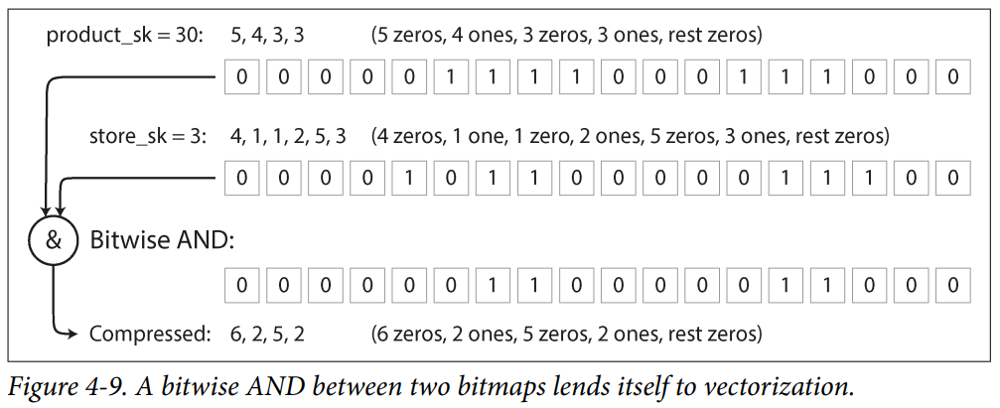

위 예시를 보면,  

1. product_sk 컬럼 = 30 (등호 연산자)
   -> 비트맵 반환

2. store_sk 컬럼 = 3 (등호 연산자)
   -> 또 다른 비트맵 반환

3. 두 비트맵을 비트 단위 AND 연산
   -> product가 30이고 store가 3인 대상을 찾음


위와 같이 행 하나씩이 아니라 묶음(벡터) 단위로 주고 받는 실행 모델을 `벡터화 처리`라 함.

비트맵 같은 자료구조를 떠나서 `묶음단위`로 처리한다는게 중요


*두 접근법의 공통점: 현대 CPU 특성 활용*  
두 구현이 매우 다르지만 둘 다 실무에서 사용되고 좋은 성능을 냄
- 무작위 접근보다 순차 접근 -> 캐시(CPU가 데이터를 가져올 때 인접한 것을 한번에 캐시에 올림) 미스 감소
- 적은 명령어 수행, 함수 호출 없음. 단순 연산만 반복하여 분기 예측 실패(branch mispredication) 회피
  - 여기서 분기예측실패란, if-else같은 분기가 많으면 cpu는 분기에 필요한 결과가 나오기 전에 예측을 하는데 추측이 실제 결과와 다른 경우 작업을 전부 폐기해고 다시 진행함. 단순하고 일관된 명령에서는 이런 분기 예측 실패가 없음
- 병렬성 활용
- 디코딩하지 않고 압축된 데이터에 직접 연산 -> 메모리 할당-복사 비용 절감

## 2-4. Materialized Views and Data Cubes
#### Materialized view  
관계형 데이터 모델에서 뷰는 그 내용이 어떤 쿼리의 결과인 테이블같은 객체 이다.

가상 뷰(Virture View)와 구체화 뷰(Materialized View)로 나뉘는데,  
가상 뷰
- 본질 : 쿼리를 쓰는 단축키
- 읽을때 : SQL엔진이 즉성에서 원본 쿼리로 펼처서 실행
- 비용 : 매번 계산

구체화뷰  
- 본질 : 쿼리 결과의 실제 복사본. 디스크에 기록
- 이미 저장된 결과를 그냥 읽음
- 미리 계산해둠

*Materialized View의 트레이드오프*  
원본 데이터가 바뀌면 구체화 뷰도 그에 맞게 갱신되어야 한다.
- 비용 : 이런 갱신은 쓰기 작업을 늘림
- 이점 : 같원 쿼리를 반복수행하는 워크로드에서 읽기 성능을 크게 개선


*Materialized Aggregate(구체화 집계)*  
Materialized Aggregates는 구체화 뷰(Materialized view)의 한 종류인데 데이터 웨어하우스에서 특히 유용하다.

- 데이터 웨어하우스 쿼리는 집계 (ex, SUM, COUNT, AVG 등)를 많이 사용
- 같은 집계를 많은 쿼리가 사용한다면 -> 원시 데이터를 매번 처음부터 계산하는 것은 낭비
- 자주 쓰는 카운트나 합계를 캐싱하는것 -> 데이터 큐브의 발상


#### Data Cube(데이터 큐브)
데이터 큐브는 다차원 집계의 구체화 뷰로, 2차원 데이터큐브는 다음과 같다.

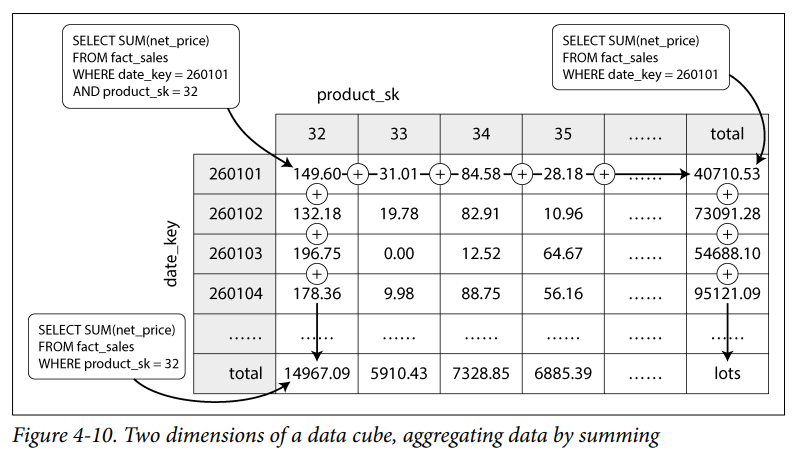

위 그림은 상품과 날짜의 차원으로 매출 합계를 보여주는 2차원 데이터 큐브이다.

차원이 3개 이상인 경우에도 원리는 동일하다.

*데이터 큐브의 트레이드오프*  
- 특정 쿼리가 매우 빨라짐(미리 계산되어 있으므로)
- 원시 데이터를 쿼리할때만큼의 유연성이 떨어짐.
- 결론 : 자주 사용되는 특정 집계 쿼리에 대해서 데이터큐브를 만들어 성능을 증가시킬 수 있다.


## 3. Multidimensional and Full-Text Indexes(다차원 인덱스와 전문 인덱스)

B-Tree, LSM-Tree같은 경우 단일 속성에 대한 범위 쿼리는 가능하다.  
하지만 단일 속성 컴색으로는 부족할때가 있음


*concatenated Index(연결 인덱스)*  
여러 필드를 단순이 이어붙여 하나의 키로 만든 멀티 컬럼 인덱스이다.

ex) (성 + 이름) : 성과 이름을 붙여 인덱스 만들기

위 방식의 단점은, 성을 떼고 이름만으로 찾으려고 하는 경우에는 무용지물이다.


*Multidimensional Index(다차원 인덱스)*  
지도상의 범위내에서 식당을 찾는 쿼리를 보자.

```sql
SELECT * 
  FROM restaurants
 WHERE latitude  > 51.4946 AND latitude  < 51.5079
   AND longitude > -0.1162 AND longitude < -0.1004;
```

연결인덱스에서는 이 쿼리를 효율적으로 처리하지 못한다. (위도, 경도 두 컬럼을 동시에 처리할 수 없음)

해결책은 
- 공간채움곡선(space-filing curve)으로 2차원 위치를 단일숫자로 표현한 후 B-tree 사용
- 더 흔하게는 R-tree, Bkd-tree 같은 공간 특화 인덱스

지리 외 활용도
- red, green, blue 3차원 인덱스로 특정 색상 범위 검색
- 날씨DB : 날짜, 온도(date, temperature) 2차원 인덱스로 동시에 좁힙(1차원 인덱스는 date로 필터링 후 temperature로 필터링해야함)


## 3-1. Full-Text Search(전문 검색)
전문검색은  
문서 모음을 본문 어디서든 나타날 수 있느 키워드로 검색할 수 있게 함.

*핵심*  
전문검색은 본질적으로 또 하나의 다차원 쿼리라고 볼 수 있다.

- 본문에 나타날 수 있는 단어(term)가 하나의 차원
- 문서의 본문에 단어 x가 포함되면 차원 x에서 값 1, 아니면 0
- ex) 'red apple' 검색 => red 차원에서 1, apple 차원에서 1인 문서 검색


*역색인(inverted index)*  
많은 검색엔진이 사용하는 자료구조임.

- key-value 구조이며 key는 단어(term), value는 그 단어가 포함된 문서ID의 목록
- 문서ID가 순차적인 숫자이면, 희소 비트맵(sparse bitmap)으로 표현 가능


역색인 기반 시스템  
- Lucene : elasticsearch, Apache Solr이 사용하는 전문(full-text) 인덱싱 엔진
- PostgreSQL GIN 인덱스


*n-gram*  
n-gram이란?  
단어로 쪼개는 대신 길이가 n인 모든 부분 문자열을 다루는 것.  
ex) hello -> n=3이면 'hel', 'ell', 'llo' 이렇게 3-gram이 됨

n-gram을 사용하면 임의의 3글자 이상의 부분만자열을 검색 가능.  
정규표현식 검색도 가능  

다만, 단점으론 인덱스가 꽤 큼


*편집 거리(edit distance) 검색*  
Lucene의 경우, 오타가 발생했을때에도 편집거리(문자 1개가 추가, 제거, 변경된 케이스) 검색이 가능하다.


방식으로는  
- 유한 상태 오토마톤 (finite state automaton)으로 저장한 후 레벤슈타인 오토마톤(Levenshtein automaton)으로 변환해 효율적 검색을 함

ex) '프로그래밍'을 찾는데 실수로 '프로그레밍'이라고 잘못 검색했다고 치자.  
편집거리 검색은 이렇게 한두글자 틀리는 경우에도 검색이 가능하도록 하는 방식인데

방식은  

##### 1단계: 사전을 글자 트리로 저장해 둔다

사전의 모든 단어는 글자를 공유하는 나무 형태로 저장돼 있다. "프로그" 로 시작하는 단어들을 그려보면:

```
프 ─ 로 ─ 그 ─ 래 ─ 밍      (프로그래밍)
              └ 램 ─ 등     (프로그램 등...)
```

`프 → 로 → 그` 까지는 여러 단어가 길을 공유하다가, 그 뒤에서 갈라진다. 사전을 이렇게 "글자를 따라 내려가는 길"로 만들어 둔 게 핵심이다.


##### 2단계: "프로그레밍"으로 판정 기계로 판단 (레벤슈타인 오토마톤)

사용자가 친 "프로그레밍"과 허용 거리 1을 가지고, 일종의 검문소 기계를 만든다. 이 기계의 역할은 하나다.

> 아무 단어나 글자를 하나씩 넣어주면, "이 단어는 '프로그레밍'에서 한 글자 이내 차이냐, 아니냐"를 판정한다.

이 기계는 글자를 읽을 때마다 "지금까지 편집을 몇 번 썼는가"를 상태로 들고 다닌다. 사전 단어 "프로그래밍"을 이 기계에 한 글자씩 먹여본다.

| 넣은 글자 | 기계가 기대한 글자 | 결과 | 남은 편집 허용 |
|---|---|---|---|
| 프 | 프 | 일치 | 1 (그대로) |
| 로 | 로 | 일치 | 1 (그대로) |
| 그 | 그 | 일치 | 1 (그대로) |
| 래 | 레 | **불일치 → 교체 1회 사용** | 0 (다 씀) |
| 밍 | 밍 | 일치 | 0 |

마지막까지 왔을 때 편집을 1번만 썼고(허용치 1 이내), 단어도 끝났다 → **이 기계는 "프로그래밍"을 통과시킨다.**

반대로 사전에 "프린터"라는 단어가 있었다면, 두 번째 글자 "린"에서부터 어긋나고 그 뒤로도 계속 어긋나서 편집 허용치 1을 금방 넘긴다. 그러면 기계는 일찌감치 **탈락**시킨다. 끝까지 안 가고 중간에 잘라낸다는 점이 중요하다.


## 3-2. Vector Embeddings(벡터 임베딩)  
시멘틱 검색(semantic search) : 동의어, 오타를 넘어 문서의 개념과 사용자의 의도를 이해하는 검색. AI응용에 중요한 부분


벡터임베딩이란?  
문서의 의미 파악을 위해 `임베딩 모델`이 텍스트를 부동소수점 값들의 벡터 로 변환.
- 벡터 : 다차원 공간의 한 점.
- 의미적으로 유사한 문서일수록, 임베딩이 서로 가까이에 생성됨


ex) 농업 위키 페이지를 3차원 벡터 임베딩한 값 분석
```text
농업 위키 페이지:      [0.38, 0.83, 0.41]
채소 위키 페이지:      [0.36, 0.64, 0.67]  ← 농업과 가까움
스타 스키마 페이지:    [0.85, 0.10, -0.52] ← 비교적 멀리
```

가깝고 멀고의 거리를 측정하기 위한 두 가지 거리함수가 있다.
- 코사인 유사도(cosine similarity) : 두 벡터 사이 각도의 코사인 값으로 근접도 측정
- 유클리드 거리(Euclidean distance) : 두 벡터 사이의 직선 거리로 근접도 측정

Word2Vec, BERT, GTP 등 텍스트 데이터를 위한 초기 다양한 임베딩 모델이 있고,  
최근엔 멀티모달(한 모델이 텍스트-이미지 등 여러 양식의 임베딩을 생성)


##### Vector Index(벡터 인덱스)
Vector Index(벡터 인덱스)는 문서 집합의 벡터 임베딩을 저장한다.

벡터인덱스에 질의하려면,  
1. 쿼리를 임베딩 모델에 넣어서 벡터 임베딩을 생성하고
2. 그 벡터임베딩으로 유사한 벡터를 가진 문서를 찾는다.


R-tree는 고차원 베거에 잘 맞지 않아서, 전용 벡터 인덱스를 사용하는데,  
###### Flat indexes
- 동작 : 벡터를 그대로 저장, 쿼리가 모든 벡터와 거리를 측정함
- 특성 : 정확하지만 느림

###### IVF(Inverted File) indexes
- 동작 : 벡터 공간을 파티션(centroids라 불리는)으로 클러스터링해서 비교대상을 축소. 쿼리가 검사할 파티션 수(probe)를 지정
- 특징 : 검사할 파티션 수(prode)를 늘리면 정확도가 올라가지만 느려짐


##### HNSW(Hierarchical Navigable Small World) indexes
- 동작 : 벡터 공간을 여러 계층의 그래프로 유지
  1. 최상층(노드가 적음)에서 가장 가까운 벡터를 찾음
  2. 아래층에서 내려가면서 가까운 벡터 탐색
  3. 마지막층까지 반복
- 특성 : 근사(approximate)적이지만 빠름

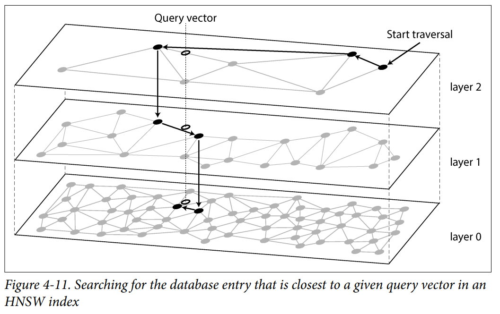


## 4. Summary
```text
                    스토리지 엔진
                         │
        ┌────────────────┴────────────────┐
       OLTP                              OLAP
   (소량·빈번·빠른 응답)            (대량 스캔·복잡 분석)
        │                                 │
   ┌────┴────┐                    컬럼 지향 저장
로그 구조    제자리 갱신            + 압축 + 비트맵
(쓰기 유리)  (읽기 유리)            + JIT/벡터화
   │             │
LSM/SSTable   B-트리
RocksDB,등    (관계형 표준)

         그 위에 다중 조건 검색 계층:
   다차원(R-트리) · 전문검색(역색인) · 벡터(IVF/HNSW)
```

기억할 가치가 있는 통찰들
1. 저장 방식은 워크로드가 결정한다. 워크로드에 맞는 트레이드오프 선택이 있을 뿐
2. 반복되는 핵심 트레이드오프: 쓰기 vs 읽기. 로그 구조(불변·순차·append)는 쓰기를, 제자리 갱신(B-트리)은 읽기를 가져간다.
3. 소수의 아이디어가 모든 곳에서 변주된다. "불변 정렬 파일 + 백그라운드 병합 + 비트맵 벡터 연산 + 근사로 속도 얻기"라는 핵심 도구들이 OLTP → OLAP → 전문 검색 → 벡터 검색까지 무대만 바꿔 계속 재등장한다
4. 이 지식의 실용적 가치: 제품 사용법을 외우는 게 아니라, 튜닝 파라미터를 보고 그 효과를 추론하고, 어떤 DB 문서든 설계 의도를 읽어내는 능력을 갖추는 것.


